# Combat Technical Documentation

This document provides a comprehensive guide on the current combat system, covering:
- How and where to test it
- The AI behaviour under the hood
- Configuration settings, their roles, and locations

## How to Test the Current Version of the Combat System

## Test Map 

Test Map could be found here:
```
/Content/NoComments/Maps/L_Fight_Test
```


## Player

### Controls
To control the player character, use the following key layout:
- **WASD** - Movement
- **Right Mouse Button (hold)** - Block
- **Left Mouse Button (press)** - Attack (right-hand jab)

### Settings
All player-related parameters are located in:
**/Content/NoComments/DataAssets/CombatSettings/DA_CombatSettings_Player** Data Asset:

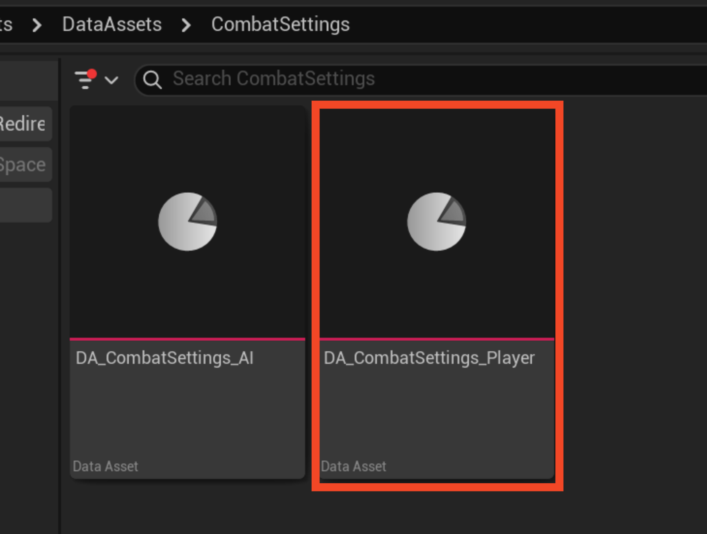

#### Configurable Parameters:
- **Attack Speed** - Speed of the attack animation montage. A value of `1.0` means the montage plays at its original speed. `2.0` doubles the speed.
- **Block Walk Speed** - The player's movement speed while blocking.
- **Default Walk Speed** - The player's movement speed when not blocking.

#### Damage Dealing Sphere Parameters
The **Damage Dealing Sphere** is a collider spawned and attached to the player's fist during an attack to apply damage to overlapping enemies:
- **Debug Show Damage Dealing Sphere** - Enables visualisation of the sphere when attacking.
- **Damage Dealing Sphere Radius** - Defines the collider's size, affecting how precisely damage is registered.

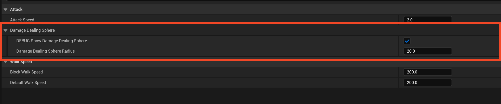

*Click the arrow next to the **Damage Dealing Sphere** category to expand these parameters.*

## AI

All AI-related settings are located in:
**/Content/NoComments/DataAssets/CombatSettings** Data Asset:

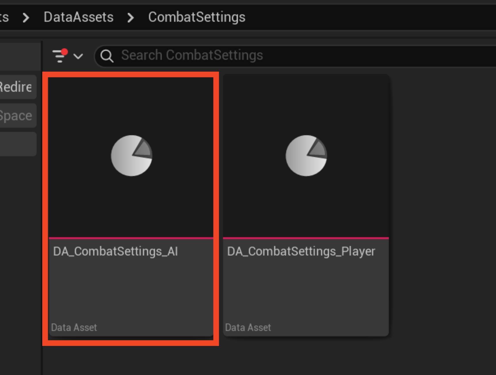

The following parameters share the same meaning as their player counterparts:
- **Attack Speed**
- **Block Walk Speed**
- **Default Walk Speed**
- **Damage Dealing Sphere Parameters**

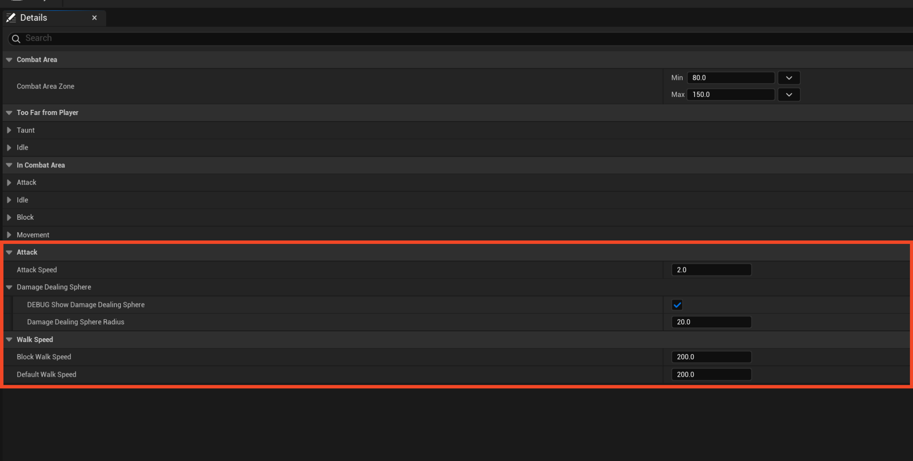

All additional AI parameters are explained alongside the AI behaviour breakdown.

### AI Behaviour
The AI follows two concurrent decision-making processes:
1. **Action Decision Making** - Determines the AI's actions (attacks, blocking, taunts, etc.).
2. **Movement Decision Making** - Governs AI positioning relative to the player.

This approach enhances variety and realism in AI behaviour.

#### Movement States
AI movement operates within three primary states, determined by distance from the player:
- **Too Far from Player**
- **In Combat Zone**
- **Too Close to Player**

The **State Tree** checks distance every tick, allowing for dynamic state switching and action cancellation when the player's distance changes. Movement is also disabled when an animation montage (such as an attack or taunt) is playing.

##### Distance-Based States

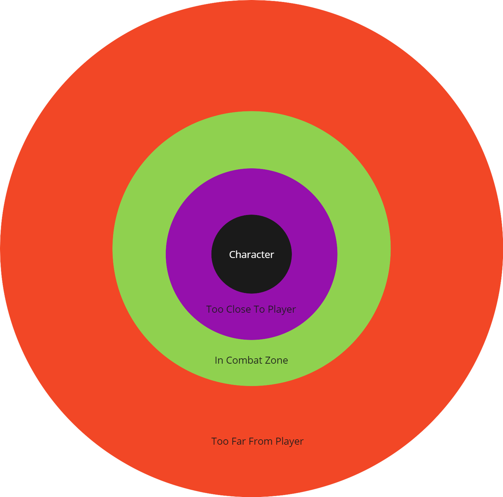

AI settings allow modification of the Combat Zone boundaries:

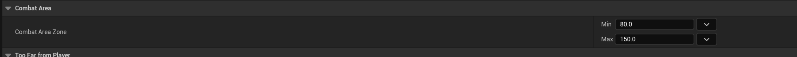

- If the AI's distance to the player is **less than** `Min`, it is considered *too close*.
- If the AI's distance is **greater than** `Max`, it is considered *too far*.
- Otherwise, the AI remains in the *Combat Zone*.

##### Movement Logic

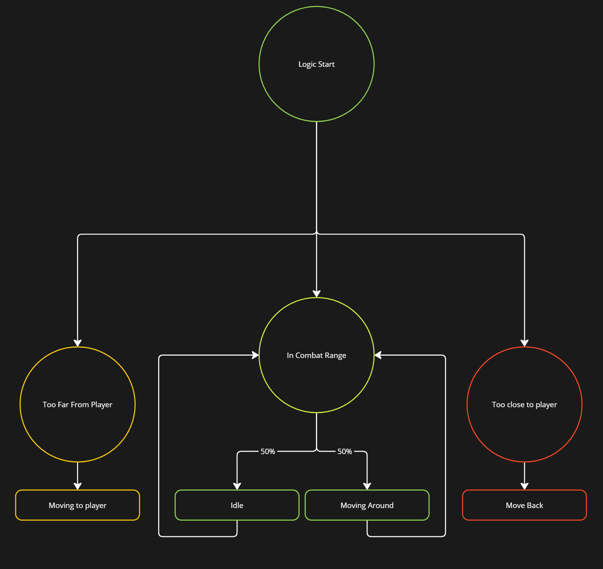

###### Too Far from Player
The AI moves toward the player to re-enter the Combat Zone unless an animation (e.g., a taunt) is playing.

###### Too Close to Player
The AI moves backward until it is back in the Combat Zone.

###### In Combat Zone
The AI randomly selects between two movement substates:
1. **Idle** - The AI stands still for a random duration (defined by *Idle Decision Making Time Range Within Combat Area*).

   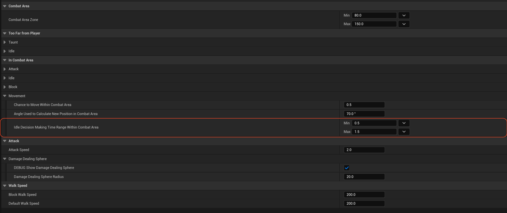

2. **Moving Around** - The AI shifts position within the Combat Zone. It moves either left or right, choosing a position based on a rotated vector (currently 70°).

   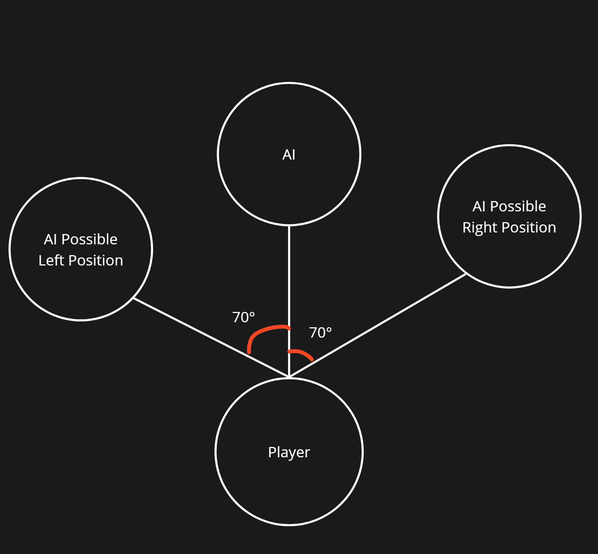

   **Configurable Settings:**
   - **Chance to Move Within Combat Area** - Probability (0-1) of selecting movement over idling.
   - **Angle Used to Calculate New Position in Combat Area** - Defines the movement angle (e.g., 70°).

   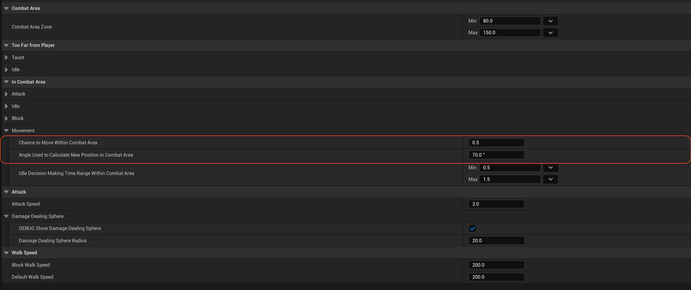

### Action Decision Making
The AI determines whether to attack, block, taunt, or remain idle based on its current state.

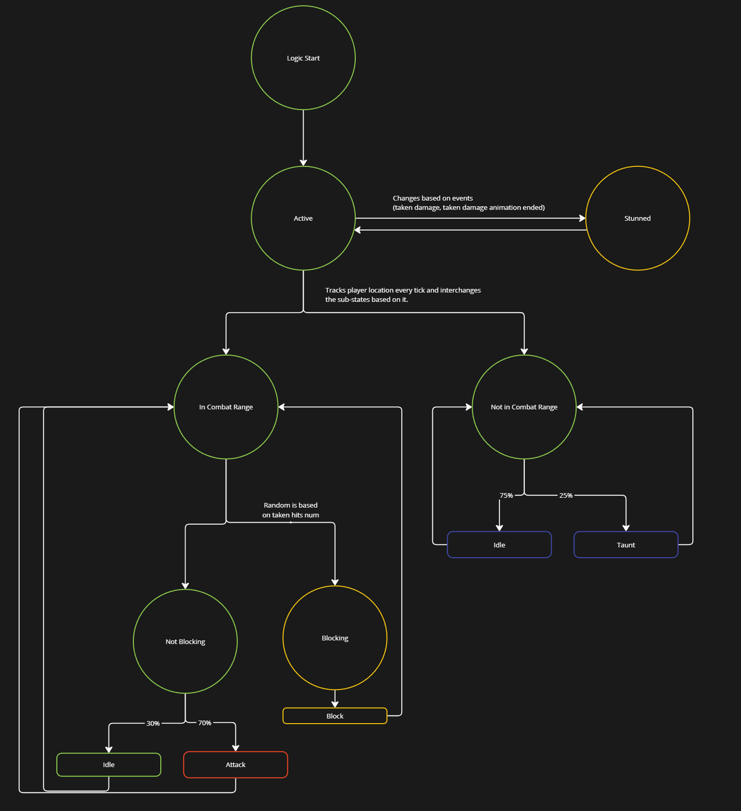

#### Active vs. Stunned States
- **Active** - Default state; AI performs actions like attacking, blocking, or taunting.
- **Stunned** - Triggered when taking an unblocked hit; interrupts all non-blocking actions.

#### Not in Combat Range
- **Taunt** - The AI selects a random taunt animation from the **Taunt Montages** list:

   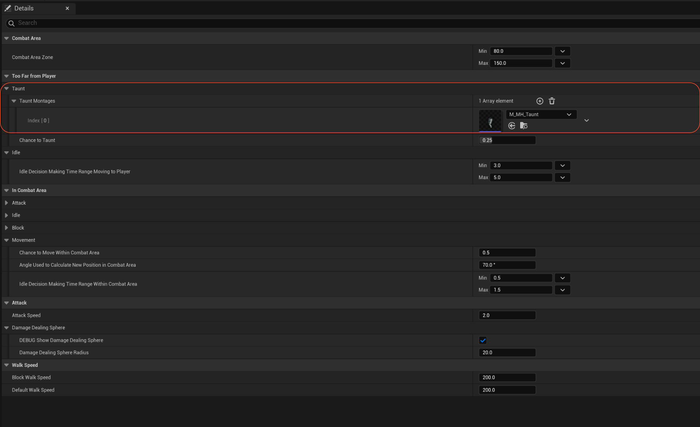

   - You can add as many as you need, the system will consider them automatically. Just make sure you are using Metahuman skeleton.  
   - Chance to taunt is defined in **Chance to Taunt** (default: 25%).

- **Idle** - AI does nothing for a random duration, determined by **Idle Decision Making Time Range Moving to Player**.

#### In Combat Area
The AI randomly chooses between **Blocking** and **Not Blocking**, with blocking probability increasing based on recent hits taken, and reset every time the AI starts blocking.

###### Block Probability Distribution
- 0 hits - 0% chance to block
- 1 hit - 50% chance to block
- 2 hits - 70% chance to block
- 3 hits - 90% chance to block
- 4 hits - 100% chance to block

This correlation is defined via a **Block Chance Based on Taken Hits** curve:

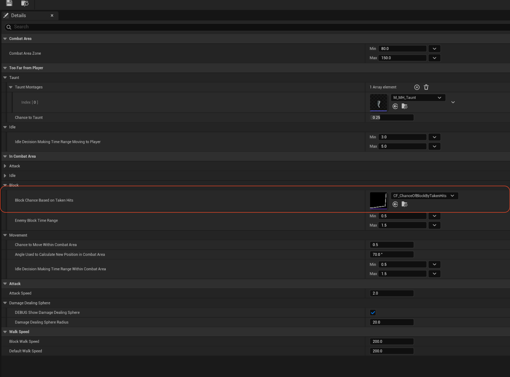

- **Time** - Number of hits taken.
- **Value** - Probability of blocking.

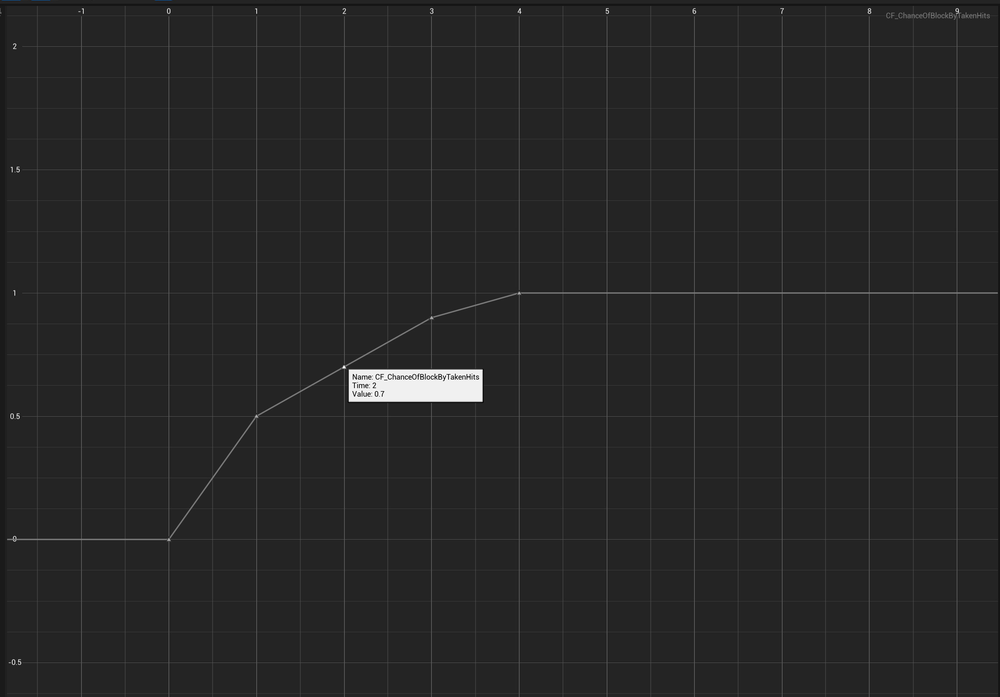

Blocking duration is determined by **Enemy Block Time Range**.

###### Not Blocking Substates
1. **Idle** - AI stands still (configured via **Chance of Going Idle When Not Blocking** and **Idle Decision Making Time Range Not Blocking**).
2. **Attack** - AI selects an attack animation from **DA_CombatAnimations**, with weighted probabilities for light, mid, and heavy attacks:

   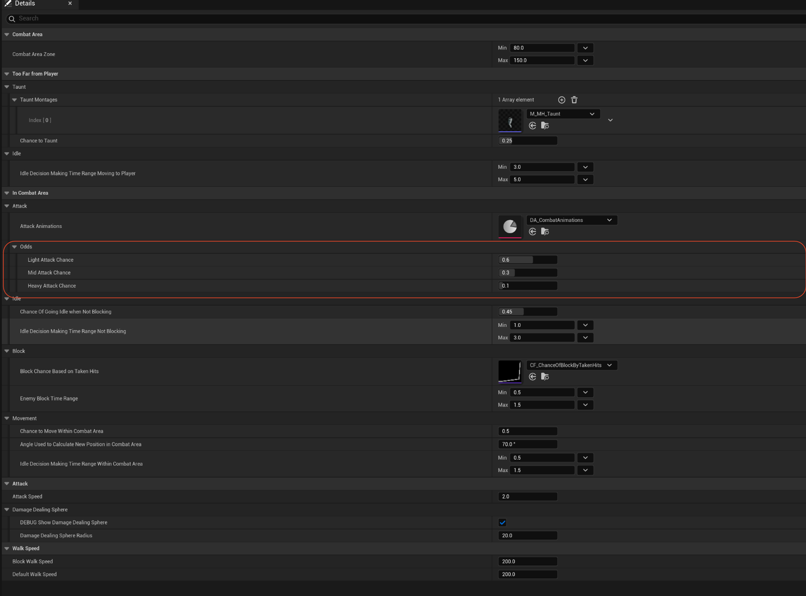

   Each attack type has a pool of animations:
   - **Light Attacks**
   - **Mid Attacks**
   - **Heavy Attacks**

   Each entry in these lists consists of:
   - **Attack Animation Montage** - The animation played.
   - **Damage Dealing Component Socket Name** - The bone to attach the damage sphere to.

   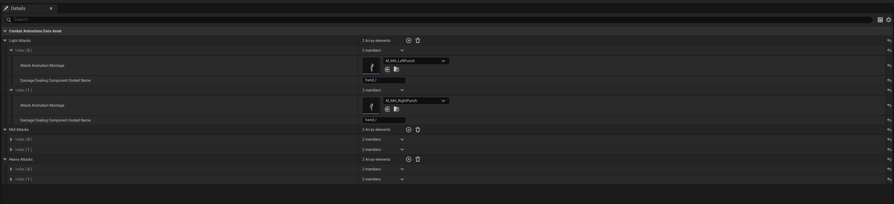

New animations can be added, provided they use the Metahuman skeleton.