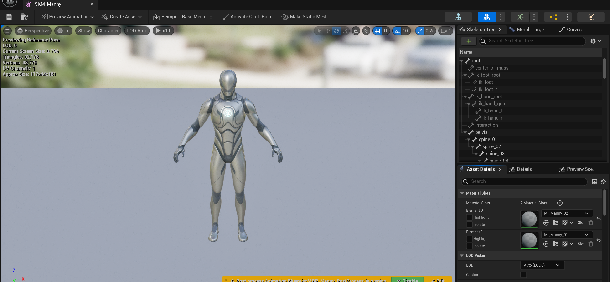
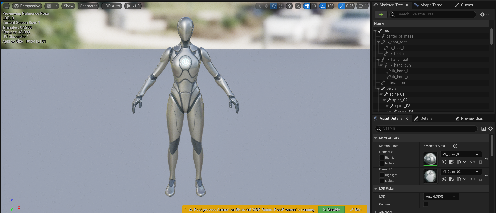

# Advanced Games Programming Project
**Advanced Programming**

**Dmitrii Kolchin**  
**2220982**

[Github](https://github.com/DmitryKolchin/NoComments)

## Video Demostration 

<iframe width="560" height="315" src="https://www.youtube.com/embed/7AVJmlmcAbQ?si=AzrDwSdJx6O193-E" title="YouTube video player" frameborder="0" allow="accelerometer; autoplay; clipboard-write; encrypted-media; gyroscope; picture-in-picture; web-share" referrerpolicy="strict-origin-when-cross-origin" allowfullscreen></iframe>

## Pre-Production

### Planning Proof of Concept Prototypes

For October, I have outlined the development of two key prototypes: the **Combat Prototype** and the **Stealth System Prototype**. To streamline the workflow and ensure efficient task management, I established a dedicated ClickUp workspace for real-time task tracking. This eliminates the need to track progress  in my head and provides a clear, organised project overview.

<iframe class="clickup-embed" src="https://sharing.clickup.com/9015630444/c/h/8cnz6kc-115/69343aec5fbc962" onwheel="" width="100%" height="700px" style="background: transparent; border: 1px solid #ccc;"></iframe>

*Figure 1. ClickUp project plan layout*

The project is divided into two primary milestones: the **Stealth Prototype** and the **Combat Prototype**. Each prototype is further broken down into specific subtasks to ensure a clear development path.

#### Stealth Prototype Subtasks:
- **Player Stance Control**: Implementing mechanics for switching between standing and crouching, giving players the ability to dynamically alter their movement posture.
- **Enemy Detection**: Adding a system where enemies can detect the player based on line of sight.
- **Enemy Awareness Levels**: Creating multiple states of enemy awareness to simulate realistic stealth mechanics.
- **Invisibility Zones**: Introducing zones where the player can remain hidden from enemies, enhancing the stealth gameplay.
- **Procedural Content Generation (PCG) for Grass**: Using PCG to populate invisibility zones with grass, adding a visual cue for players.

#### Combat Prototype Subtasks:
- **Combat Mechanics**: Developing basic hit and block mechanics to lay the foundation for player combat.
- **NPC Combat Behaviour**: Implementing AI for non-player characters (NPCs) to react to player attacks.
- **Camera Soft-Lock**: Integrating a camera system that soft-locks onto targets during combat for a more focused player experience.

The task titled **Research State Tree** is a shared objective across both prototypes, as a unified state tree system is essential for managing the different states in both combat and stealth mechanics.

### Integrating Default Unreal Skeletal Meshes

Given that the prototype phase does not require complex visual assets, I imported Unreal Engine's default skeletal meshes to be used for both player and NPC characters. This approach saves time on asset creation while still providing functional models for testing gameplay mechanics.


*Figure 2. Manny skeletal mesh*  


*Figure 3. Quinn skeletal mesh*

### Setting Up the Basic Controllable Character

For player character control, I utilised Unreal Engine’s [Enhanced Input](https://dev.epicgames.com/documentation/en-us/unreal-engine/enhanced-input-in-unreal-engine) system. This system, which is replacing the deprecated input implementation, allows for greater flexibility in managing input contexts. By leveraging **Mapping Contexts**, I can efficiently switch between combat and stealth controls without the need for manual input handling.

For example, combat inputs are unnecessary during stealth gameplay. By removing the combat mapping context and adding the stealth mapping context, I can ensure that only relevant inputs are active. To ensure modularity, I created a separate **Mapping Context** for basic actions like movement and camera control. This context is shared across both prototypes to avoid redundant code.

<iframe width="100%" height="500px" src="https://blueprintue.com/render/yz-ogp8q/" scrolling="no" allowfullscreen></iframe>

*Figure 4. Enahnced input logic handling*

## Combat System 
### Research

From a narrative perspective, all the combat encounters in the *No Comments* beta version are one-on-one, close-quarter battles within mosh pits, surrounded by a cheering crowd. This setting inspired me to look towards *Mafia II* (Mafia II, 2010), specifically its prison sequence, as a key reference for the combat system:

<iframe width="560" height="315" src="https://www.youtube.com/embed/ihEJRwTLGEc?si=SERZ-Vp1orE_BfYb&amp;start=573" title="YouTube video player" frameborder="0" allow="accelerometer; autoplay; clipboard-write; encrypted-media; gyroscope; picture-in-picture; web-share" referrerpolicy="strict-origin-when-cross-origin" allowfullscreen></iframe>

*Figure 5. Mafia 2 Remastered- Life In A Prison  (Mafia 2 Definitive Edition Prison Mission 1080p 60fps ) 2020*


In this sequence, the combat actions are straightforward yet engaging, consisting of the following moves:
- Block
- Dodge
- Light Attack
- Heavy Attack

These moves are available to both the player and NPCs, creating a balanced and engaging gameplay experience. This simple yet effective system fits our initial concept, allowing us to create intense and dynamic fights.

Additionally, the player character is soft-locked onto the enemy, making it easier to target and maintain focus in combat. This feature enhances the fluidity of the fighting mechanics, ensuring a more accessible experience for players.

The original vision for the combat system is to be "easy to learn, hard to master," where each fight feels like a challenge without being overwhelming at first. To lay the groundwork for this system, we’ve broken it down into the following core elements for initial implementation:
- Block
- Light Attack (Jab)
- Soft Lock onto Enemy

These mechanics will be accessible to both the player and NPCs. As development progresses, we plan to expand the system, introducing dodges, heavy attacks, and potentially a combo system to increase depth and complexity.

#### Additional References

We’ve also explored alternative combat systems for inspiration:

- *GTA V* (Grand Theft Auto V, 2013): The combat system in *GTA V*  is simple yet challenging, relying on dodges, blocks, and light/heavy attacks, providing a satisfying balance for player engagement.
  
<iframe width="560" height="315" src="https://www.youtube.com/embed/P2lwi1qLLkM?si=4-faYfHt_akD4oTB&amp;start=573" title="YouTube video player" frameborder="0" allow="accelerometer; autoplay; clipboard-write; encrypted-media; gyroscope; picture-in-picture; web-share" referrerpolicy="strict-origin-when-cross-origin" allowfullscreen></iframe>

*Figure 6. Grand Theft Auto V PS5 - Street Fights With Trevor [4K HDR 60fps] 2022*

- *Sifu* (Sifu, 2022): This game offers a more intricate combat system, featuring a variety of combos, blocks, and crowd control mechanics. While it’s likely too complex for our student project, its approach to multiple-enemy combat is something we might explore in future iterations.

<iframe width="560" height="315" src="https://www.youtube.com/embed/tGtr_qJDQXw?si=nfeEpo8A0HQt21Db&amp;start=573" title="YouTube video player" frameborder="0" allow="accelerometer; autoplay; clipboard-write; encrypted-media; gyroscope; picture-in-picture; web-share" referrerpolicy="strict-origin-when-cross-origin" allowfullscreen></iframe>

*Figure 7. I went Ultra Instinct for a moment| Sifu PS5 2022*


This evolving framework will help shape our combat system, ensuring that it remains manageable yet open to future enhancements.
Here's the refactored markdown document with more depth and clarity, while addressing logical and grammatical errors:

### Architecture Design

Before implementing the combat system, I decided to spend some time carefully designing the system architecture. Although we are currently working on a proof-of-concept prototype, developing a scalable design from the outset will save significant time in the future.

Here’s the architecture I’ve designed:

The combat system can be split into two main parts:
- **Player Combat**
- **AI Combat**

However, both parts share a significant amount of functionality, such as:
- Moving towards the opponent
- Entering/Exiting a blocking state: The character plays a blocking animation, reducing damage significantly. The damage reduction percentage should be an exposed parameter, allowing easy adjustment during balancing. The character can still move while blocking.
- Performing punches (left jab/right jab): Animations that deal damage to the opponent if they successfully land.
- Soft-locking to the opponent for easier targeting and smoother combat.

**Player Combat** is fully controlled by player input. This means that attacks, blocks, and movement are triggered exclusively by key presses.

**AI Combat**, in contrast, derives its inputs from an AI State Tree, rather than from a player’s keyboard or controller.

To avoid duplicating shared logic between the Player and AI characters, I devised the following architecture:


*Figure 8. Class hierarchy scheme*

Let me explain the components in more detail:

#### Combat Component
This component, which is central to the entire system, handles the shared logic between Player Combat and AI Combat. As per the Unreal Documentation [(Components in Unreal Engine | Unreal Engine 5.5 Documentation | Epic Developer Community, s.d.)](https://dev.epicgames.com/documentation/en-us/unreal-engine/components-in-unreal-engine), components are ideal for encapsulating common behaviors that can be shared between different actors. The **Combat Component** provides a public interface and implements all the core functionality. Here’s a breakdown of its key functions:
- `LeftHandJab()` and `RightHandJab()` trigger the respective punch animation montage.
- `StartBlock()` and `QuitBlock()` activate and deactivate the blocking state for the owning character.
 These functions modify a boolean variable within the component. 
 To reduce coupling, I’ve designed the Animation Blueprint to read this boolean directly from the Combat Component.
  This way, if we ever need to change the skeleton, we won’t have to modify the logic inside the Combat Component itself.

#### Damage Dealing Sphere Component
The **Damage Dealing Sphere Component** is spawned by the Combat Component whenever an attack montage begins. It manages its own lifetime and self-destructs when the animation montage ends. This eliminates the need for additional variables in the Combat Component to handle the sphere’s destruction. The Damage Dealing Sphere holds the attack's damage value and applies it to any entity it overlaps. This approach is preferable to using an Animation Notify State to spawn a default sphere component because passing damage values to the Anim Notify State would require more complex logic (e.g., saving the value in the Combat Component and then retrieving it in the Anim Notify State).

#### Combat Animations Data Asset
A **Data Asset** stores information related to a specific system, allowing for easy scalability and 
customization [(Data Assets in Unreal Engine | Unreal Engine 5.5 Documentation | Epic Developer Community, s.d.)](https://dev.epicgames.com/documentation/en-us/unreal-engine/data-assets-in-unreal-engine).
The **Combat Animations Data Asset (DA)** stores all the animations for each attack. By using a Data Asset, I can easily create multiple configurations for different characters or combat styles. This flexibility allows us to switch between different animation sets with a single click, making the system highly scalable. As new features like dodges and heavy attacks are introduced, the system can be easily extended to accommodate them.
Keeping all the animations in one place also makes it easier to change them as we update our project.
This architecture ensures that our combat system is both efficient and adaptable, 
paving the way for future enhancements without unnecessary complexity.
### Implementation
#### Combat Component
BP_CombatComponent is a blueprint actor component. Due to the fact that currently I am working on the prototype, it is crucial to make the workflow as fast as possible, so the blueprints are my choice.


#### Damage Dealing Sphere Component

### Importing and retargeting animations
For the initial animations, I decided to use this asset pack since it was affordable and had everything what i need (punches and blocks) 
included


*Figure 9. The asset pack*

The only drawback was that the pack has its own Unreal Mannequin in itself. This mannequin is fully identical to the one I've already
imported to the project, but from the engine's perspective those are 2 different skeletal meshes. So, I was able to make a use of 
this videoguide:

<iframe width="560" height="315" src="https://www.youtube.com/embed/iE474cUpR-o?si=mtvZzMTAhuCWs77t" title="YouTube video player" frameborder="0" allow="accelerometer; autoplay; clipboard-write; encrypted-media; gyroscope; picture-in-picture; web-share" referrerpolicy="strict-origin-when-cross-origin" allowfullscreen></iframe>

*Figure 10. Retargeting Animations in 5.4 is Finally Easy!!! #unrealengine5 2024*

It turns out that with coming of UE 5.4 retargeting for humnoid rigs became even easier - it can automatically 
detect the bone chains and the suer just need to choose the animations to retarget. In my 
case there were no artifacts since the skeletons are identical.


*Figure 11. Animation retargeter*

And after retargeting all the animations, I removed all the old packs animations to keep the project clean.

### Adding block state to the Anim Blueprint

### Development Journal Entry

#### Block State Implementation
Before proceeding with the complete logic implementation, I began by adding block state support within the Animation Blueprint. The current block animation has fixed legs, which restricts player movement while blocking—an issue that needed addressing.

To resolve this, I added the **Merge Per Bone** node within the Animation Blueprint. This node blends the initial locomotion pose with the block animation, starting from the `spine_01` bone. The blended result is used if the `IsBlockActive` variable is `true`; otherwise, the default locomotion pose is applied. Below is the updated setup:


*Figure 12. Animation Blueprint*

#### Debugging
To simplify the Blueprint debugging process, I designed a custom function, `Print Debug`, which accepts a debug message and the function name as parameters. This utility aids in identifying issues more efficiently.

<iframe width="100%" height="500px" src="https://blueprintue.com/render/vk0i87ep/" scrolling="no" allowfullscreen></iframe>

*Figure 13. Debugging function*
#### BP_Combat Component
Given the constraints of working on a prototype and the limited time available, I opted to implement as much functionality as possible using Blueprints. Since the Combat Component does not require C++ functionality, it was created entirely in Blueprints.

All attack animations share the following logic:
- Verify all references.
- Ensure no other montage is currently playing.
- Play the desired montage.
- Spawn the Damage Dealing Component.

The only variation is the specific animation and the root bone to which the Damage Dealing Component is attached. To streamline this, I encapsulated the shared logic within the `Play Attack Montage` function:

<iframe width="100%" height="500px" src="https://blueprintue.com/render/cedwnnya/" scrolling="no" allowfullscreen></iframe>

*Figure 14. Play Attack Montage function implementation*

Each attack function now resembles the following structure:

<iframe width="100%" height="500px" src="https://blueprintue.com/render/5nmt71w2/" scrolling="no" allowfullscreen></iframe>

*Figure 15. Jab Right Hand function implementation*

#### Combat Animations Data Asset
Since inheriting from the generic `UDataAsset` class is not possible in Blueprints, this class was declared in C++. As it functions solely as a data storage asset, the `.cpp` file was deleted, leaving only the `.h` file in the project. The class is defined as follows:

```cpp
/**
 * Base class for data assets that store combat-related animations
 */
UCLASS(Blueprintable)
class NOCOMMENTS_API UCombatAnimationsDataAsset : public UDataAsset
{
	GENERATED_BODY()

public:
	UPROPERTY(EditDefaultsOnly, BlueprintReadOnly, Category = "Jabs")
	TArray<TSoftObjectPtr<UAnimMontage>> RightJabMontages;

	UPROPERTY(EditDefaultsOnly, BlueprintReadOnly, Category = "Jabs")
	TArray<TSoftObjectPtr<UAnimMontage>> LeftJabMontages;
};
```
*Figure 16. Combat Animations Data Asset*

Currently, it contains two arrays for jab animations, but it is designed to be scalable for future additions.

#### Damage Dealing Sphere Component
As inheriting Blueprint classes from `USphereComponent` is also not possible, the Damage Dealing Component was declared in C++. Below is its header file:

```cpp
UCLASS(ClassGroup = (Custom), meta = (BlueprintSpawnableComponent), Blueprintable)
class NOCOMMENTS_API UDamageDealingSphereComponent : public USphereComponent
{
	GENERATED_BODY()

protected:
	UPROPERTY(meta = (ExposeOnSpawn = true), BlueprintReadOnly)
	float Damage = 10.0f;

public:
	// Sets default values for this component's properties
	UDamageDealingSphereComponent();

	// Called every frame
	virtual void TickComponent(float DeltaTime, ELevelTick TickType, FActorComponentTickFunction* ThisTickFunction) override;

protected:
	// Called when the game starts
	virtual void BeginPlay() override;

private:
	UFUNCTION()
	void OnOwnerMontageEnded(UAnimMontage* Montage, bool bInterrupted);

	UFUNCTION()
	void OnBeginOverlap(UPrimitiveComponent* OverlappedComponent, AActor* OtherActor, UPrimitiveComponent* OtherComp, int32 OtherBodyIndex, bool bFromSweep, const FHitResult& SweepResult);
};
```
*Figure 17. Damage Dealing Sphere Component*


One notable feature is the `Damage` property, marked with the `ExposeOnSpawn` modifier, allowing it to be initialised directly during creation.

**Function Details**
- **`BeginPlay`**: Performs initial checks and binds the component to the end of the montage of the owning player:

```cpp
void UDamageDealingSphereComponent::BeginPlay()
{
	Super::BeginPlay();

	ACharacter* OwnerCharacter = Cast<ACharacter>(GetOwner());
	if (!IsValid(OwnerCharacter))
	{
		ensureAlwaysMsgf(false, TEXT("DamageDealingSphereComponent must be attached to a character"));
		return;
	}

	USkeletalMeshComponent* OwnerMesh = OwnerCharacter->GetMesh();
	if (!IsValid(OwnerMesh))
	{
		ensureAlwaysMsgf(false, TEXT("Owner character must have a skeletal mesh component"));
		return;
	}

	UAnimInstance* OwnerAnimInstance = OwnerMesh->GetAnimInstance();

	if (!IsValid(OwnerAnimInstance))
	{
		ensureAlwaysMsgf(false, TEXT("Owner character must have an anim instance"));
		return;
	}

	OwnerAnimInstance->OnMontageEnded.AddDynamic(this, &UDamageDealingSphereComponent::OnOwnerMontageEnded);
}
```
*Figure 18. Begin Play function implementation*

- **`OnOwnerMontageEnded`**: Handles self-destruction:

```cpp
void UDamageDealingSphereComponent::OnOwnerMontageEnded(UAnimMontage* Montage, bool bInterrupted)
{
	DestroyComponent();
}
```
*Figure 19. On Owner Montage Ended function implementation*

This approach allows the component to manage its lifecycle independently, reducing coupling and enabling attachment to any `ACharacter` child. It is compatible with both players and NPCs, even without a shared parent class. Later, its behaviour can be further refined via animation notifies.

- **`OnBeginOverlap`**: Applies damage using Unreal's standard damage-dealing system:

```cpp
void UDamageDealingSphereComponent::OnBeginOverlap(UPrimitiveComponent* OverlappedComponent, AActor* OtherActor, UPrimitiveComponent* OtherComp, int32 OtherBodyIndex, bool bFromSweep, const FHitResult& SweepResult)
{
	if (OtherActor == GetOwner())
	{
		return;
	}

	if (!IsValid(OtherActor))
	{
		return;
	}

	FDamageEvent DamageEvent;
	OtherActor->TakeDamage(Damage, DamageEvent, GetOwner()->GetInstigatorController(), GetOwner());
}
```
*Figure 20. On Owner Montage Ended function implementation*

## AI Behaviour

### Introduction to State Trees

One of my objectives for this project was to become familiar with Unreal Engine's new State Trees tool. State Trees can be applied to a wide range of cases involving stateful data, including AI behaviours. [(Your First 60 Minutes with StateTree | Tutorial, 2024)](https://dev.epicgames.com/community/learning/tutorials/lwnR/unreal-engine-your-first-60-minutes-with-statetree)

Here’s a concise summary of key State Tree terminology:

- **Schema**: Defines use-case specific data, constraining or expanding node usage.
- **Context**: Data from the schema, accessible to tasks and conditions.
- **Parameters**: User-defined data with customisable values for State Trees.
- **Property Categories**: Metadata for task/condition properties:
  - **Context**: Automatically binds to matching schema data.
  - **Input**: Required for task/condition functionality; must be bound for compilation.
  - **Output**: Outputs from tasks/conditions, bindable as inputs for others.
- **State**: Layers organising tasks, conditions, and transitions.
- **Transition**: Defines when and how a state changes to another.

These elements form the basis of the Combat State Tree for AI.

### AI Decision-Making

Before implementing the State Tree, I designed a conceptual scheme to outline the AI's intended behaviour.


*Figure 21. Combat AI Behaviour scheme*

This diagram shows the general flow for AI decision-making within combat.

### Combat State Tree Structure

Here is an overview of the Combat State Tree designed for AI:


*Figure 22. Combat State Tree*

Let’s go through each component in detail.

#### Schema

The **Schema** defines Context variables initialized by the State Tree Component instance for the specific actor running the State Tree. Here, I’m using the default State Tree AI Component Schema, which provides access to the AI Controller within State Tree tasks—a sufficient setup for managing in-tree logic.

#### Parameters

All parameters are organized within a separate Data Asset, providing these benefits:
- Balancing adjustments are isolated to a single file, allowing a game designer to modify values without needing to search through the State Tree.
- Commonly-used values (like attack range) are declared in one location, reducing "magic numbers" and improving maintainability.

#### Theme

This section allows for assigning different colours to various states, which visually separates different parts of the State Tree as it grows more complex. While purely cosmetic, it improves readability and navigation.

#### Root State

The **Root** state is the default state selected when the State Tree is activated. It will attempt to transition to a child state, iterating through them until a valid entry condition is met. Since **Blocking** has no entry conditions, the Root state will always transition directly to Blocking.

#### Blocking State

The **Blocking** state contains several tasks:

1. **ST_TaskBlock** (displayed as BP_Block in the State Tree) initiates blocking in the NPC’s Combat Component at the start of the state and ends blocking when the state is complete.

   <iframe src="https://blueprintue.com/render/75h3q374/" width="100%" height="500" scrolling="no" allowfullscreen></iframe>

   *Figure 23. Block State Tree Task*

   Events **Enter State** and **State Completed** are triggered by the State Tree as needed, allowing us to define relevant logic.

   To access the AI Controller, we need to mark its variable category as **Context**. Here’s an example of setting this context-based variable:

   
   
   *Figure 24. Context-based variable setup*

   Now, this variable appears in the State Tree, initialized with the AI Controller context value:

   

   *Figure 25. Example of context-based variable binding*

2. **STTask_WaitRandomTimeInRange** pauses for a random duration and then exits the state, introducing a randomised blocking time. Here’s the task’s code:

   <iframe src="https://blueprintue.com/render/0w30td-v/" width="100%" height="500" scrolling="no" allowfullscreen></iframe>
   
   *Figure 26. Wait Random Time in Range State Tree Task*

   This task uses a **Waiting Time Range** parameter, which can be defined within the State Tree or derived from a parameter Data Asset. To make this variable instance-editable, we set its category to **Parameters** and check the **Instance Editable** box:

   
   *Figure 27. Example of parameters-based variable setup*

   This setup allows us to initialize it with values from the parameter Data Asset or other State Tree parameters:

   

   *Figure 28. Example of parameters-based variable binding*

3. **STTask_GetFirstActorOfClass** finds the first actor of a specified class, in this case, the player character. This task accepts an actor class parameter and outputs a reference to the found actor:

   <iframe src="https://blueprintue.com/render/v00ik7cy/" width="100%" height="500" scrolling="no" allowfullscreen></iframe>

   *Figure 29. Get First Actor of class Task*

   To set this task’s output parameter, we categorize it as **Output** and check **Instance Editable**:

   
   *Figure 30. Example of output-based variable setup*

   This parameter is then available as input for subsequent tasks in this state:

   
   *Figure 31. Example of output-based variable binding*

4. **STTask_MoveToActor** is a custom task based on the Move To node. Unlike the default, this version restarts movement once the target is reached, enabling continuous tracking of the player. Using the default Move To Task was not feasible, as it exits the state upon completion.

The **Blocking** state has two possible transitions:
- **Attack State** if the player is within attack range.
- **Idle State** in all other cases.

#### Idle State

The **Idle** state functions similarly to **Blocking** (except for the fact it does not have STTask_Block in it), with the following transition rules:
- Transition to **Blocking** if the opponent is blocking.
- Transition to **Attack** if the opponent is within attack range.
- Transition to **Root** otherwise.
- Can transition to **Stunned** if the **AI.Event.Stunned** tag is applied (e.g., when the NPC takes damage in BP_NPC).

#### Attack State

The **Attack** state contains a single task, **STTask_Attack**, which triggers the attack logic in the NPC's Combat Component. The state transitions to **Idle** once the attack completes.

#### Stunned State

The **Stunned** state is similar to the Attack state. It plays the stunned animation and transitions back to **Blocking** upon completion.

---

This completes the current layout of the Combat State Tree. Here’s the resulting AI behaviour flow:


*Figure 32. Combat State Tree*

### Stealth State Tree Structure

The stealth system works similarly to the fighting gameplay but has its own states:

#### Idle
In the Idle state, the NPC is either patrolling or standing still. Patrolling involves navigating through a range of points defined externally. Standing involves a delay task for two seconds.

#### Suspicious
The NPC enters the Suspicious state whenever they see the character. It has three different sub-states:
- **Spotting Player**: The NPC observes the character using vision perception, increasing its awareness level every tick while looking at the player. When the awareness level reaches full, it transitions to the Chasing state. If it loses sight of the player, it transitions to the Looking Around sub-state.
- **Going to Player**: Similar to Spotting Player but actively moves toward the player.
- **Looking Around**: The NPC searches for the player. It first moves to the last seen location, then to a random location within a predefined radius. Awareness decreases every tick, and when it hits zero, the NPC returns to the Idle state.

#### Chasing
In this state, the NPC continuously follows the player.

The overall state tree looks like this:


*Figure 33. Stealth State Tree*

### Patrolling

Given that I didn’t want to hardcode all the patrolling locations to the characters, I created a convenient tool called Patrol Pathpoints for game designers to set up patrol routes around the map.


*Figure 34. Patrol Pathpoints Tool*


Here's a refactored version of your dev journal entry, structured for better readability and flow:

---

### Patrol Pathpoint

The `UPatrolPathpoint` class serves as the fundamental unit for creating patrol paths. A patrol path consists of a sequence of points in space, and NPCs move from one point to the next. The pathpoints visually represent these points.


*Figure 35. Patrol pathpoint*

#### Key Features:
- **Billboard**: Provides a visual representation that allows the game designer to select and move the point.
- **Pathpoint Index**: Represents the ordinal position of the pathpoint within the path.

The class includes two functions for game designers, enabling on-the-fly modification of the path:
- `AddPathpointForward()`: Adds a pathpoint between the current and the next one (or to the end if it's the last pathpoint).
- `AddPathpointBackward()`: Adds a pathpoint between the current and the previous one (or to the start if it's the first pathpoint).

In the editor, selecting a pathpoint shows these functions under the "Actions" section in the details view:


*Figure 36. Patrol Pathpoint functions*

#### Class Header
```cpp
UCLASS()
class NOCOMMENTS_API APatrolPathpoint : public AActor
{
	GENERATED_BODY()
	
public:
	APatrolPathpoint();
	virtual void Tick(float DeltaTime) override;

protected:
	virtual void BeginPlay() override;

private:
	UPROPERTY(EditDefaultsOnly)
	UBillboardComponent* Billboard;

	UPROPERTY()
	bool bWasDestroyed = false;

	UPROPERTY()
	int32 PathpointIndex = 0;

public:
	void SetPathpointIndex(int32 NewPathpointIndex);
	int32 GetPathpointIndex() const { return PathpointIndex; }

	FPatrolPathpointDelegate OnAddForwardPathpointRequested;
	FPatrolPathpointDelegate OnAddBackPathpointRequested;

protected:
	UFUNCTION(BlueprintImplementableEvent, CallInEditor)
	void UpdatePathpointIndexText(int32 NewIndex);

	UFUNCTION(BlueprintCallable, CallInEditor, Category="Actions")
	void AddPathpointForward();

	UFUNCTION(BlueprintCallable, CallInEditor, Category="Actions")
	void AddPathpointBackward();
};
```

*Figure 37. APatrolPathpoint class header*

Both `AddPathpoint` functions simply call the associated delegate:
```cpp
void APatrolPathpoint::AddPathpointForward()
{
	OnAddForwardPathpointRequested.Broadcast(PathpointIndex);
}

void APatrolPathpoint::AddPathpointBackward()
{
	OnAddBackPathpointRequested.Broadcast(PathpointIndex);
}
```

*Figure 38. APatrolPathpoint functions implementation*

---

### Patrol Pathpoint Manager


*Figure 39. Patrol Manager*

The `APatrolPathpointManager` serves two primary purposes:
1. It represents the first pathpoint of each patrol path.
2. It holds references to all pathpoints in the path and draws the connections between them.

One of the most interesting parts of this system was implementing the visual connection between the pathpoints. To do this, I had to enable `Tick()` calls in the editor before the simulation starts, which required overriding the `ShouldTickIfViewportsOnly()` function:
```cpp
virtual bool ShouldTickIfViewportsOnly() const override;
```

*Figure 40. Function to override to tick in editor*

The implementation looks like this:
```cpp
bool APatrolPathpointManager::ShouldTickIfViewportsOnly() const
{
	if (IsValid(GetWorld()) && GetWorld()->WorldType == EWorldType::Editor)
	{
		return true;
	}
	return false;
}
```

*Figure 41. `ShouldTickIfViewportsOnly()` implementation*

Now that ticking is enabled, the following tasks occur in the `Tick()` function:
- Draw lines between valid pathpoints.
- Remove invalid pathpoints from the array.
- Bind newly added pathpoint delegates to ensure `AddPathpointForward` and `AddPathpointBackward` work as expected.

```cpp
void APatrolPathpointManager::Tick(float DeltaTime)
{
	Super::Tick(DeltaTime);

	for (int32 PathpointIndex = 0; PathpointIndex < Pathpoints.Num(); ++PathpointIndex)
	{
		if (!IsValid(Pathpoints[PathpointIndex]))
		{
			OnPathpointDestroyed(PathpointIndex);
			--PathpointIndex;
			continue;
		}

		TryBindPathpointEvents(Pathpoints[PathpointIndex]);

		FVector CurrentPathpointLocation = Pathpoints[PathpointIndex]->GetActorLocation();
		FVector LastPathpointLocation = Pathpoints.IsValidIndex(PathpointIndex - 1) && IsValid(Pathpoints[PathpointIndex - 1])
			? Pathpoints[PathpointIndex - 1]->GetActorLocation()
			: GetActorLocation();
		
		DrawDebugDirectionalArrow(GetWorld(), LastPathpointLocation, CurrentPathpointLocation, 10.f, LinesColor, false, 0.f, 0, LinesThickness);
	}

	if (PathType == EPatrolPathType::Loop && !Pathpoints.IsEmpty())
	{
		FVector LastPathpointLocation = Pathpoints.Last()->GetActorLocation();
		FVector PathStartLocation = GetActorLocation();
		DrawDebugDirectionalArrow(GetWorld(), LastPathpointLocation, PathStartLocation, 10.f, LinesColor, false, 0.f, 0, LinesThickness);
	}
}
```

*Figure 42. Tick function*

The `EPatrolPathType` enum defines whether the path should loop or move back and forth:

```cpp
UENUM(BlueprintType)
enum class EPatrolPathType : uint8
{
	BackAndForth,
	Loop
};
```

*Figure 43. `EPatrolPathType` enum*

Depending on the path type, the manager either draws an additional line from the last pathpoint to the start (for looped paths) or not.

#### Additional Functions for Game Designers:
- `AddPathpointToStart()`: Adds a pathpoint between the manager and the first pathpoint (or spawns the first pathpoint if there are none).
- `AddPathpointToEnd()`: Adds a pathpoint after the last one (or spawns the first pathpoint if there are none).

The manager also includes a function that returns the complete patrol path, which includes:
- Locations of the pathpoints
- The patrol path type

This data is encapsulated in a custom structure:

```cpp
USTRUCT(BlueprintType)
struct FPatrolPathData
{
	GENERATED_BODY()

	UPROPERTY(BlueprintReadWrite)
	EPatrolPathType PathType = EPatrolPathType::BackAndForth;

	UPROPERTY(BlueprintReadWrite)
	TArray<FVector> PathpointLocations;
};
```

*Figure 44. Patrol Path Data structure*

#### Pathpoint Manager Header
```cpp
UCLASS()
class NOCOMMENTS_API APatrolPathpointManager : public AActor
{
	GENERATED_BODY()

protected:
	virtual void BeginPlay() override;

public:
	APatrolPathpointManager();
	virtual bool ShouldTickIfViewportsOnly() const override;
	virtual void Tick(float DeltaTime) override;
	virtual void Destroyed() override;
	virtual void PostDuplicate(EDuplicateMode::Type DuplicateMode) override;
	virtual void PostLoad() override;

private:
	UPROPERTY(EditDefaultsOnly, Category="Components")
	UBillboardComponent* Billboard;

	UPROPERTY(EditDefaultsOnly)
	TSubclassOf<APatrolPathpoint> PathpointClass = APatrolPathpoint::StaticClass();

	UPROPERTY()
	TArray<APatrolPathpoint*> Pathpoints;

	UPROPERTY(EditAnywhere, Category="Path Settings")
	EPatrolPathType PathType = EPatrolPathType::BackAndForth;

	UPROPERTY(EditAnywhere, Category="Lines Settings")
	FColor LinesColor = FColor::Red;

	UPROPERTY(EditAnywhere, Category="Lines Settings")
	float LinesThickness = 2.f;

public:
	UFUNCTION(BlueprintPure)
	FPatrolPathData GetPatrolPathData() const;

protected:
	UFUNCTION(BlueprintCallable, CallInEditor, Category = "Actions")
	void AddPathpointToEnd();

	UFUNCTION(Blueprintable, CallInEditor, Category="Actions")
	void AddPathpointToStart();

private:
	void AddPathpoint(const FVector &NewPathpointLocation, const int32 NewPathpointIndex = INDEX_NONE);
	void RecalculatePathpointsIndexesStartingFromIndex(int32 StartingIndex = 0);
	void RecalculateAllPathpointsIndexes();

	UFUNCTION(CallInEditor)
	void OnAddForwardPathpointRequested(int32 PathpointIndex);

	UFUNCTION(CallInEditor)
	void OnAddBackPathpointRequested(int32 PathpointIndex);

	UFUNCTION(CallInEditor)
	void OnPathpointDestroyed(int32 PathpointIndex);

	void TryBindPathpointEvents(APatrolPathpoint* Pathpoint);
};
```

*Figure 45. Pathpoint Manager class header*

#### Example of usage
Here you can see how it is intended to be used:
<iframe width="560" height="315" src="https://www.youtube.com/embed/11zEl7JXNlw?si=NOHkxzAR1WTlB-2C" title="YouTube video player" frameborder="0" allow="accelerometer; autoplay; clipboard-write; encrypted-media; gyroscope; picture-in-picture; web-share" referrerpolicy="strict-origin-when-cross-origin" allowfullscreen></iframe>

*Figure 46. Pathpoint tool usage example*

---

### Reflection

#### What Went Well
- **Markdown Practice**: This term marked the first time I used Markdown extensively for documentation, and it was incredibly convenient.
- **Work Distribution**: The workload was well spread throughout the term, avoiding last-minute stress and extra work on the final day.
- **State Trees Experience**: I gained substantial experience working with state trees. This was my first time spending so much time with a behavior editor, and it's the most complex AI I've worked on so far.
- **Final Major Project Foundation**: I've laid the groundwork for the Final Major Project, and the next steps should be much smoother now.

#### Areas for Improvement
- **Testing in Machinations.io**: I didn't have the opportunity to test my behaviors in Machinations.io, but I plan to use it more frequently in the production phase.
- **Prototype Quality**: The prototype is quite raw and couldn’t be playtested by others. Given the project's scale, my other responsibilities, and my lack of experience, I didn’t expect to deliver a fully playable version by the end of the term. However, this is something to consider for future projects.
- **Pathpoint Plugin**: The patrolling pathpoints could have been developed as a plugin for easier reuse in other projects.
- **Blueprint to C++ Conversion**: All the Blueprint code should eventually be migrated to C++ for better performance and scalability.
- **State Tree Refinement**: With the new knowledge gained, I now know how to refine and improve the state trees for future use.

#### Final Thoughts
Overall, it's been a solid effort. There's plenty of room for improvement, but a lot has been accomplished.

---
# Bibliography
- AI Perception in Unreal Engine | Unreal Engine 5.5 Documentation | Epic Developer Community | Epic Developer Community (s.d.) At: https://dev.epicgames.com/documentation/en-us/unreal-engine/ai-perception-in-unreal-engine (Accessed  05/11/2024).
- Components in Unreal Engine | Unreal Engine 5.5 Documentation | Epic Developer Community (s.d.) At: https://dev.epicgames.com/documentation/en-us/unreal-engine/components-in-unreal-engine (Accessed  09/10/2024).
- Data Assets in Unreal Engine | Unreal Engine 5.5 Documentation | Epic Developer Community (s.d.) At: https://dev.epicgames.com/documentation/en-us/unreal-engine/data-assets-in-unreal-engine (Accessed  09/10/2024).
- Enhanced Input in Unreal Engine | Unreal Engine 5.5 Documentation | Epic Developer Community (s.d.) At: https://dev.epicgames.com/documentation/en-us/unreal-engine/enhanced-input-in-unreal-engine (Accessed  01/10/2024).
- Grand Theft Auto V (2013) 
- Grand Theft Auto V PS5 - Street Fights With Trevor [4K HDR 60fps] (2022) At: https://www.youtube.com/watch?v=P2lwi1qLLkM (Accessed  18/10/2024).
- I went Ultra Instinct for a moment| Sifu PS5 (2022) At: https://www.youtube.com/watch?v=tGtr_qJDQXw (Accessed  18/10/2024).
- Mafia 2 Remastered- Life In A Prison  (Mafia 2 Definitive Edition Prison Mission 1080p 60fps ) (2020) At: https://www.youtube.com/watch?v=ihEJRwTLGEc (Accessed  11/10/2024).
- Mafia II (2010) 
- Mafia II: Definitive Edition (2020) 
- Retargeting Animations in 5.4 is Finally Easy!!! #unrealengine5 (2024) At: https://www.youtube.com/watch?v=iE474cUpR-o (Accessed  09/10/2024).
- Sifu (2022) 
- Unreal Engine Tips #8 | Visualize AI Perception using AI Debugging Tool (2020) At: https://www.youtube.com/watch?v=Xe-Y9zK79S8 (Accessed  05/11/2024).
- Your First 60 Minutes with StateTree | Tutorial (2024) At: https://dev.epicgames.com/community/learning/tutorials/lwnR/unreal-engine-your-first-60-minutes-with-statetree (Accessed  02/10/2024).


# Declared Assets

[Animations](https://www.unrealengine.com/marketplace/en-US/product/fighting-animations)

Assets created / added by Sam Lake:
- Content/Migrate - all the files in this folder
- Content/MS_Presets - all the files in this folder
- Content/NoComments/Audio - all the files in this folder
- L_TropicalCarWash

AI Generated content:
- DevelopmentJournal.md


