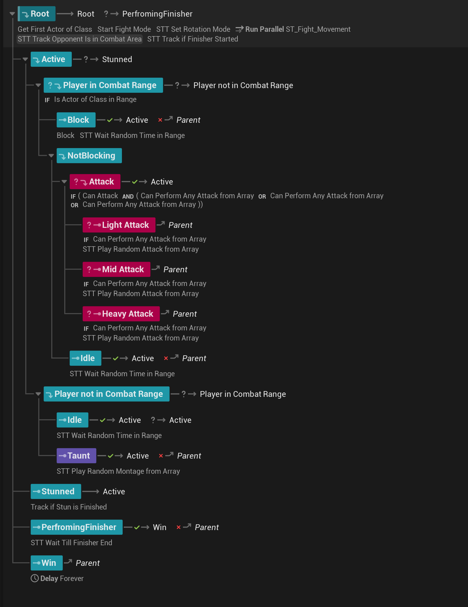
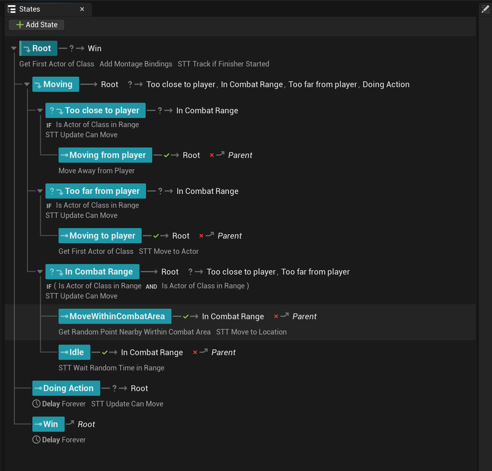
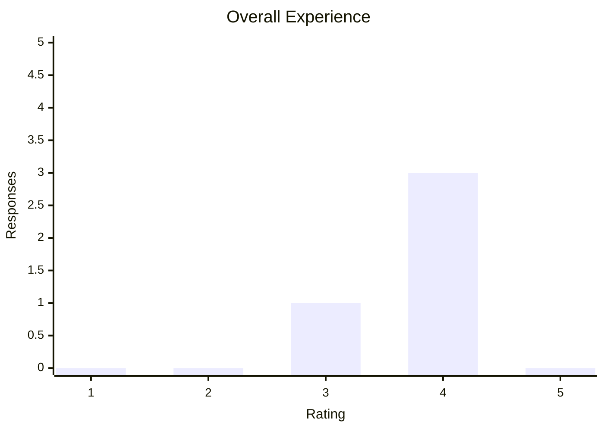
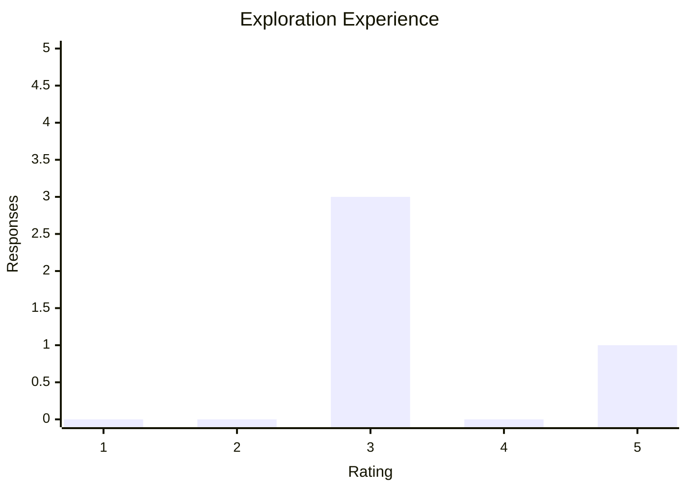
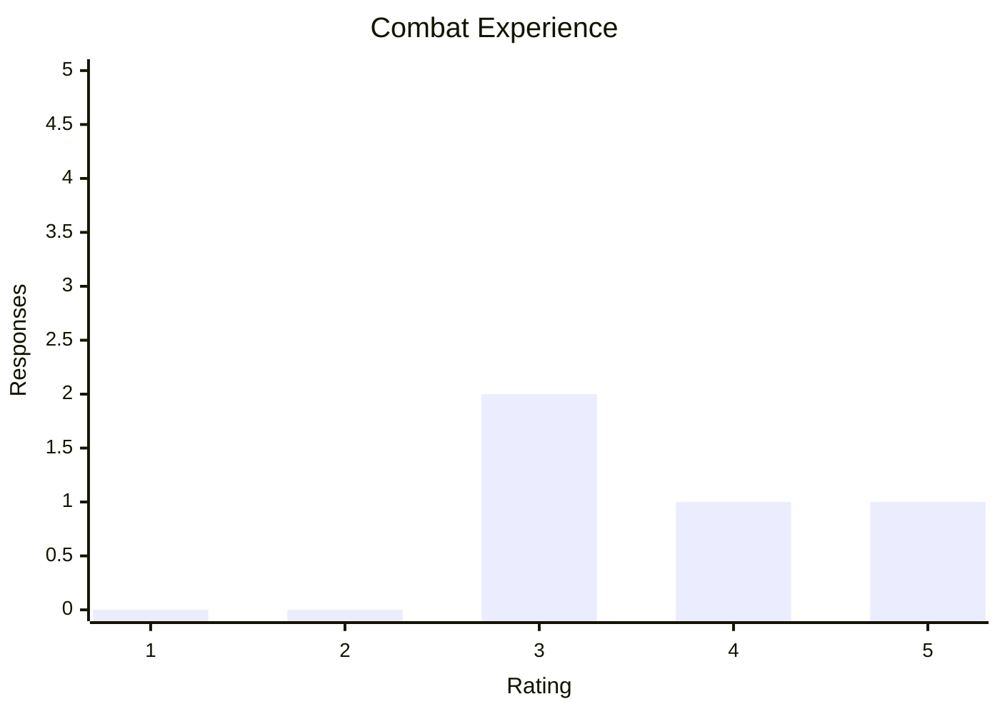
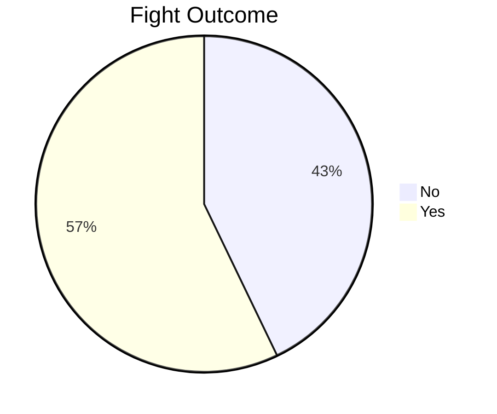

# Final Major Project

## Project Outline

**No Comments** is a third-person action game set in the underworld of low-level UK criminal activity. The narrative follows a single protagonist across a timeline stretching from school years to an unavoidable, consequential end. While stylistically inspired by the *Grand Theft Auto* franchise, the game eschews the open-world format in favour of more focused, linear gameplay combined with deeper, more punishing mechanics. A core feature is the implementation of hidden "stats" that are influenced by player decisions, creating branching gameplay outcomes and affecting future events.

For instance, the result of the first in-game fight (win or lose) will dynamically adjust the player's “Strength” parameter. A victory may boost this stat, potentially making future encounters easier, while a loss could reduce it, increasing difficulty. Importantly, these stats remain hidden from the player, encouraging immersive, in-world decision-making rather than number crunching.

---

### Minimal Goal – Fully Polished Fight Level

The fighting system forms the backbone of *No Comments* and is currently the central focus of development. The minimal deliverable for the project is a fully functional and polished combat level, complete with engaging and responsive brawling mechanics.

#### Key Objectives:
- Design a compact but immersive level centred around hand-to-hand combat.
- Develop enemy AI that presents a fair but challenging opponent.
- Implement responsive controls and impactful animations to convey weight and momentum.

#### Anticipated Challenges:
- Creating intelligent AI that adapts to player behaviour without becoming predictable.
- Ensuring that punches and movement feel “heavy” and satisfying through a combination of sound, visual feedback, and animation timing.
- Delivering fluid, context-aware animations that support both combat mechanics and the game's overall tone.

---

### Desired Goal – Stealth Integration

A stealth level is a secondary goal for the project, intended to provide variety and additional depth. The intention is to allow players the choice between silent infiltration and open combat. Ideally, stealth segments will transition smoothly into fights when necessary, depending on player choice or failure.

#### Key Objectives:
- Design a level that encourages exploration and experimentation with stealth mechanics.
- Integrate the fighting system seamlessly with stealth to allow for dynamic gameplay shifts.

#### Anticipated Challenges:
- Balancing stealth and combat to ensure neither approach trivialises the other.
- Managing transitions between stealth and combat states smoothly to avoid breaking immersion.
- Creating AI behaviours that can respond intelligently to both stealthy and aggressive playstyles.

---

### Aspirational Goal – Dynamic Hidden Stats and Event Variety

The hidden stat system is one of the project’s most distinctive features, offering a subtle but significant impact on gameplay and narrative progression. These stats, while not shown explicitly to the player, will shape encounters and potentially alter the path of the story. Although relatively straightforward to implement from a technical perspective, these systems require significant design iteration and testing to balance properly.

#### Key Objectives:
- Introduce at least three hidden parameters (Health, Damage, Intelligence, Stamina, Agility) that evolve based on player's actions.
- Link these stats to gameplay elements in a way that feels organic and meaningful.
- Introduce branching narrative or gameplay events that reflect the player’s stat profile, increasing replayability.

#### Anticipated Challenges:
- Making the impact of hidden stats noticeable without exposing numerical values.
- Ensuring that all gameplay paths remain viable, yet offer distinct challenges and outcomes.
- Avoiding excessive linearity by designing enough variance to encourage multiple playthroughs.

---

## Research

### Methodology

In shaping the technical direction of this project, I focused on two key sources of guidance: one for general software development practices and one specific to Unreal Engine development.

1. **Code Quality and Maintainability**
   To ensure clean, scalable, and maintainable code, I relied heavily on the principles outlined in *Steve McConnell’s Code Complete*. The book offers comprehensive insights into software construction, covering design, coding, testing, debugging, and refactoring. McConnell emphasises techniques for managing complexity—crucial for creating readable code that can be easily modified even months later. These best practices are widely respected within the development community. As Agostini notes, *“The author went over hundreds of books, articles, research papers… and compiled all of them into a book”* [(Agostini, 2017)](https://agostini.tech/2017/05/08/book-review-code-complete-2/). Similarly, Campos highlights that *“It emphasizes the importance of managing complexity and offers practical techniques for developing maintainable code”* [(Campos, 2024)](https://medium.com/@rodolfocampos459/code-complete-2nd-edition-review-e3e087591355).

2. **Up-to-Date Unreal Engine Development**
   For engine-specific implementation, I followed the official *Unreal Engine* documentation and educational content released through *Unreal Fest* presentations. Unlike many third-party tutorials, which often become outdated due to the rapid evolution from UE4 to UE5, official resources are consistently aligned with the latest engine versions. This was echoed by users in the Epic Games community forum, one of whom stated: *“Older tutorials are hopelessly wrong about node usage as the engine changed,”* and noted that creators often *“don’t bother to update their tutorials”* [(Epic Games Forum, 2020)](https://forums.unrealengine.com/t/can-we-start-cracking-down-on-people-who-leave-old-outdated-tutorials/147658). To avoid unnecessary confusion and deprecated APIs, I prioritised Epic's samples and documentation over unofficial sources.


To inform the gameplay and mechanics of *No Comment*, we studied various critically acclaimed titles with systems aligning with our design goals. These references guided feature development and long-term design aspirations.

**Sleeping Dogs – Hand-to-Hand Combat**

*Sleeping Dogs*, developed by United Front Games, received an average critic score of 80/100 on Metacritic [(Sleeping Dogs Reviews, n.d.)](https://www.metacritic.com/game/sleeping-dogs/). Its hand-to-hand combat was especially well received, with IGN’s Moriarty stating:

> *“Hand-to-hand combat... is button-mashy and simple – almost Arkham City-like — but works really well and makes Grand Theft Auto IV look subpar and archaic by comparison”* [(Moriarty, 2012)](https://www.ign.com/articles/2012/08/14/sleeping-dogs-review).

While the fights in *Sleeping Dogs* allow the player to defeat multiple enemies with relative ease, our design in *No Comment* aims for a more challenging combat experience early in the game. However, if the player becomes highly skilled in fist fighting through gameplay, we want them to achieve a similarly fluid "free-flow" feel. This aspect is not targeted for the initial FMP submission but is part of our roadmap for post-submission development.

<iframe height="100%" width="100%" src="https://www.youtube.com/embed/jZySMyIsyl8?si=HCfu2cIQvtvD87GO" title="YouTube video player" frameborder="0" allowfullscreen></iframe>  

*Figure 1. Sleeping Dogs – hand-to-hand combat example*

---

**Metal Gear Solid 3 – Stealth AI Behaviour**

The *Metal Gear* series has set the standard for stealth-based gameplay. *MGS3: Snake Eater* is often cited as one of the best stealth games ever made—ranked 12th by Dexerto [(20 best stealth games, 2025)](https://www.dexerto.com/gaming/best-stealth-games-3052750/)—and *MGS5* was placed second by Polygon [(Henry, 2022)](https://www.polygon.com/what-to-play/23361626/best-stealth-video-games-metal-gear-solid-splinter-cell-ps4-ps5-xbox-one-series-x).

We specifically looked to *MGS3* for inspiration regarding enemy AI behaviours. The game is known for its intelligent enemy responses; as noted in reviews,

> *“The enemies might be the smartest I've seen since the first Half-Life... they see and hear much better and know how to use cover”* [(MobyGames, n.d.)](https://www.mobygames.com/game/15735/metal-gear-solid-3-snake-eater/reviews/#:~:text=The%20stealth%20aspects%20of%20the,previous%20installment%2C%20and%20the%20CQC).
> Another reviewer highlighted that
> *“The game may leave you feeling frustrated with enemy AI or constantly being spotted… This forces you to sit back and scope out the AI’s patterns or just look for an alternate method”* [(Culture Crossfire, n.d.)](https://culturecrossfire.com/gaming/ps3/metal-gear-solid-3-snake-eater-subsistence-retro-review/#:~:text=First%20off%2C%20there%E2%80%99s%20no%20radar,could%20get%20caught%20at%20any).

While replicating the full complexity of *MGS3*'s AI is beyond the scope of our FMP timeframe, our goal is to capture the foundational behaviours: vision-based detection, sound-based awareness, pursuit logic, and player-search routines. These will form the base of our stealth system and can be expanded in future development.

<iframe height="100%" width="100%" src="https://www.youtube.com/embed/9egLjM139ms?si=nFWp7ozKMZeK7w6Y" title="YouTube video player" frameborder="0" allowfullscreen></iframe> 
 
*Figure 2. Metal Gear Solid 3: Snake Eater – complex stealth gameplay*

---

**Kingdom Come: Deliverance – Skill Progression System**

*Kingdom Come: Deliverance*, a realism-focused medieval RPG by Warhorse Studios, implements a unique skill progression system where abilities improve only through repeated use, rather than abstract XP distribution. As Game Director Dan Vávra explains:

> *“The RPG is no more about the dices and stats—it could be completely skill-based and it will finally resemble the real world…”* [(RPG Codex, n.d.)](https://rpgcodex.net/content.php?id=8776#:~:text=that%20it%27s%20possible%20to%20make,Stats%20are%20also%20needed).

The game has been praised for this approach, which ties player performance directly to mechanical improvement:

> *“We get better only by actually performing the thing we intend to get good at”* [(GameCritics, n.d.)](https://gamecritics.com/gc-staff/kingdom-come-deliverance-royal-edition-review/#:~:text=dedicated%20play%2C%20we%20glimpse%20the,intend%20to%20get%20good%20at).

This philosophy is something we aim to adopt in *No Comment* for long-term development. Instead of arbitrary stat increases, we want progression to be experienced through gameplay itself—encouraging skill mastery and providing meaningful, satisfying feedback to the player.


*Figure 3. Kingdom Come: Deliverance – vast list of different skills, each of which requires related action to be done more in oreder to progress*

## Implementation

### Fight Imrpovements

#### Separating Movement and Combat Logic

One of the key challenges encountered while implementing the initial prototype of the combat AI during the first term was integrating combat logic—such as punches, taunts, and blocks—with movement logic, including approaches like advancing towards, retreating from, or circling the player within the arena.

Both combat and movement required their own state-driven decision-making, and early attempts at combining them within a single State Tree led to a highly entangled structure. These two systems—though conceptually separate—became heavily interdependent, creating a risk where any modification in one area could introduce bugs in the other. This complexity violated the *Single Responsibility Principle (SRP)*, a core tenet of clean software architecture. As explained by freeCodeCamp, "When a class has a lot of logic interwoven together, fixing errors becomes difficult. As the codebase grows, so does the complexity, making it harder to understand and maintain." [(freeCodeCamp, 2022)](https://www.freecodecamp.org/news/solid-principles-single-responsibility-principle-explained/). This correlates with one of the refactoring reasons provided by McConell: "If you find a class that takes ownership for a hodgepodge of unrelated responsibilities, that class should be broken up into multiple classes, each of which has responsibility for a cohesive set responsibilities" (McConnell, 2004:566).

To address this, I decided to split the logic into two distinct State Trees: one for combat actions and another for movement. This separation brought several benefits:

* **Improved maintainability**: Each tree handles only its specific concern, significantly reducing the likelihood of introducing side effects when making changes.
* **Clearer logic flow**: The movement State Tree and the combat State Tree operate independently and are only loosely coupled through the AI Character itself (e.g., movement can be halted during montage playback).
* **More scalable architecture**: It became much easier to iterate and extend each behaviour individually.

Below are visual representations of the updated logic:


*Figure 4. Fight State Tree. Has only action-related logic, like blocks, attacks and taunts. Launches the movement state tree tow work in parallel.*


*Figure 5. Move State Tree. Works in parallelel with the Fight State Tree. Changes the behavior based on the distance to player.*

This refactoring enabled the implementation of more sophisticated and believable enemy behaviour:

* Enemies now dynamically reposition: moving toward the player if too far, retreating if too close, and circling when within optimal attack range.
* Enemies can simultaneously move and block, improving both visual fidelity and gameplay fluidity.

The result is a more dynamic and readable fight loop, demonstrated below:


*Figure 6. Updated Fight. AI behavior became more complex compared to the previpus prototype.*

---

#### Leveraging Considerations in UE 5.5

Another notable enhancement to the AI system came from using a new feature introduced in Unreal Engine 5.5: **Considerations** within State Trees. As showcased in [Unreal Fest 2024](https://www.youtube.com/watch?v=YEmq4kcblj4&t=1807s), this system allows each possible state to be assigned a *dynamically calculated weight*, with the parent state automatically selecting the one with the highest value.

This mechanism enabled more reactive and context-sensitive behaviour. For example, the likelihood of an NPC initiating a block now increases the more hits it has taken since its last block. The weight is modulated using a designer-friendly curve, making it easy to fine-tune the balancing logic.

Below is the blueprint logic for this system:

<iframe width=800 height=800 src="https://blueprintue.com/render/2saltplb/" scrolling="no" allowfullscreen></iframe>  
<iframe height="100%" width="100%" src="https://blueprintue.com/render/2saltplb/" scrolling="no" allowfullscreen></iframe>  

*Figure 7. Consideration. Returns the weight of "Blocking" state based on number of taken hits since previous block. The more hits taken - the more the chance of switching to block.*

This approach brings combat AI closer to player expectations and offers deeper design flexibility for future iterations.

### Enhancing Animation with Motion Matching

The previous fighting system worked functionally but lacked visual appeal—animations felt abrupt, blending was stiff, and the overall gameplay looked unpolished. To resolve this, I implemented **Motion Matching**, a feature introduced in Unreal Engine’s Animation Sample Project [(Game Animation Sample Project in Unreal Engine | Unreal Engine 5.5 Documentation | Epic Developer Community, s.d.)](https://dev.epicgames.com/documentation/en-us/unreal-engine/game-animation-sample-project-in-unreal-engine).

This project provided everything needed:

* A comprehensive set of movement animations (including crouching and directional movement)
* A ready-to-use Animation Blueprint with Motion Matching logic
* A working retargeter for adapting animations to Metahuman

The core of this implementation is the Animation Blueprint, which leverages several experimental nodes:


<iframe height="100%" width="100%"  src="https://blueprintue.com/render/5gcghn21/" scrolling="no" allowfullscreen></iframe>

*Figure 7. Pre-montage Locomotion setup. Before applying any motages, we need to apply motion matching, additive lean and aim offset.*

**Motion Matching Node:**
Selects animation frames from a Pose Search Database using a trajectory query. Supports dynamic blend time, database filtering via Choosers, and post-selection adjustments.

**Update\_MotionMatching / PostSelection:**
First one filters databases using a Chooser. Second handles logic after selection—like caching data or adjusting blend parameters.

**Simple Additive Lean:**
Adds lateral leaning based on acceleration, improving realism during movement.

**Simple Aim Offset:**
Makes the character look toward the camera direction with smooth blending using Dead Blending.

<iframe height="100%" width="100%"  src="https://blueprintue.com/render/32qzj0ts/" scrolling="no" allowfullscreen></iframe>

*Figure 8. Montage blending and post-montage logic. After we injected the montage data, we can correct the root bone offset to control the mesh rotation and location, and setup the Foot IK. The final result goes to Pose History node for the Motion Matching to work.*

**Offset Root Bone (Experimental):**
Offsets the root bone to keep the mesh planted. Helps with rotation and movement alignment but still has limitations (e.g. no collision checks).

**Simple Leg IK Process:**
Pins feet to IK targets, improving foot placement and blend quality.

**Pose History Node:**
Feeds trajectory data for Motion Matching. Controls sampling rate and bones used for matching.

---

To further improve visual polish, I tweaked the FOV dynamically based on character gait:

```cpp
float ANCCharacter_Player::GetFOV() const
{
	if ( !GetVelocity().IsNearlyZero() )
	{
		return GetMotionMatchingGait() == EMotionMatchingGait::Walking
			       ? GetActiveCameraSettings().FOVWalking
			       : GetActiveCameraSettings().FOVRunning;
	}
	else
	{
		return GetActiveCameraSettings().FOVIdle;
	}
}
```
*Figure 9. FOV change based on the current character gait and velocity.*

The final result is a much smoother and more reactive animation system:


*Figure 10. Smooth locomotion and POV blending make the result look more polished.*

### Metahuman Data Extractor

#### Motivation

The *No Comments* project makes extensive use of Epic Games’ **MetaHuman** technology for all characters, including the player, enemies, and NPCs [(MetaHuman | Realistic Person Creator, s.d.)](https://www.unrealengine.com/en-US/metahuman). While this decision supports high-quality character visuals and animation fidelity, it introduced a number of significant technical challenges during implementation in Unreal Engine:

- Each MetaHuman is imported into Unreal Engine as a unique Blueprint containing specific skeletal meshes and groom (hair) components.
- Consequently, using multiple MetaHumans in a project often necessitates the creation of distinct character classes for each one.
- Attempting to integrate these elements into a unified, custom character class requires laborious manual transfer of skeletal mesh components from the MetaHuman Blueprint.
- Moreover, the rigid structure of the auto-generated Blueprints prevents developers from dynamically assigning MetaHuman assets at runtime, due to hardcoded references.

To address these challenges, I designed and implemented a custom plugin: **Metahuman Components Data Extractor**.

*Figure 11. Metahuman Components Data Extractor Plugin is recognized as a plugin by Unreal Engine and can be disabled in the Plugins settings.*

---

#### Components Data Asset

The plugin’s core component is the `UMetahumanComponentsDataAsset`, a data asset designed to store and manage MetaHuman component data in a modular, runtime-accessible form. Its key elements include:

- **SkeletalMeshComponents**: A map of `FName` to `USkeletalMeshComponent*` that stores labelled skeletal mesh components (e.g., “Face”, “Body”) from the original MetaHuman Blueprint.
- **GroomComponents**: A similar map for hair and facial hair components.
- **SourceMetahumanBlueprint**: A `TSoftObjectPtr<UBlueprint>` reference pointing to the original MetaHuman Blueprint. As a soft reference, it avoids loading the entire asset into memory unless explicitly needed, which helps optimise performance and reduce memory overhead. [(Referencing Assets in Unreal Engine | Unreal Engine 5.5 Documentation | Epic Developer Community, s.d.)](https://dev.epicgames.com/documentation/en-us/unreal-engine/referencing-assets-in-unreal-engine)


*Figure 12. Metahuman Components Data Asset example*

The plugin provides a critical function, `ExtractDataFromMetahumanBlueprint()`, which automates the process of parsing a provided MetaHuman Blueprint and extracting all relevant components. These are then stored in the data asset for use within a shared custom character class.

#### Metahuman Setup Workflow

To streamline the character setup process and make it more user-friendly, I developed a **custom Editor Utility Widget**. This tool allows you to fully populate the necessary data by simply selecting the appropriate Data Asset and the Metahuman Blueprint imported via the Metahuman system. The widget handles the rest, significantly reducing the manual workload involved in preparing characters.


*Figure 13. Example of extracting data from Metahuman blueprint via the Editor Utility Widget*

Once the component data has been exported and stored within the Data Asset, it needs to be applied to the character in-game. This is where the `UMetahumanBuilderComponent` comes into play.

Although the plugin is still in development and currently lacks full polish, it provides the core functionality required for runtime setup. I plan to improve its usability post-submission, but for now, the setup process involves the following steps:

1. **Attach the `UMetahumanBuilderComponent` to your character.**

2. **If no skeletal meshes are assigned**, the component will generate all necessary skeletal meshes from the provided Metahuman data.

3. **If the character has a single skeletal mesh**, it will be used as the main body mesh, while the component attaches all additional skeletal meshes and grooms accordingly.

4. **If the character includes multiple skeletal meshes**, the system will default to using the first mesh returned by the `GetComponents()` call as the body.
   If a specific mesh needs to be used, you can override it using `SetBodySkeletalMeshOverrideName()` in C++ or by setting the value directly in the Blueprint’s Details panel.

   
   *Figure 14. Body Skeletal Mesh Override field in Blueprint Details panel example*

5. **To finalise the build process**, you must call `InitializeManagedOwnerComponents()`.
   It is strongly recommended to invoke this in the `PostActorCreated()` method. Doing so allows you to set the Data Asset via Blueprint defaults, ensuring the Metahuman is built automatically when the character is placed in the level:

   ```cpp
   void ANCCharacter_Base::PostActorCreated()
   {
       Super::PostActorCreated();

       // Skip execution on the Class Default Object
       if (HasAnyFlags(RF_ClassDefaultObject))
       {
           return;
       }

       if (!IsValid(MetahumanBuilderComponent))
       {
           ensureAlwaysMsgf(false, TEXT("!IsValid(MetahumanBuilderComponent)"));
           return;
       }

       MetahumanBuilderComponent->InitializeManagedOwnerComponents();
   }
   ```

   *Figure 15. Example of calling `InitializeManagedOwnerComponents()` within the PostActorCreated, so the Metahuman could be built in Editor, before runtime.*

6. **Specify the Import Settings** using a `UMetahumanBuilderComponentImportSettingsDataAsset`.
   This Data Asset holds override rules for properties that should *not* be copied from the main Data Asset—e.g., the Animation Blueprint, which you may want to maintain separately from the reference data.

   
   *Figure 16. Example of Import Settings Data Asset with the ```AnimClass``` propertry specified as ignored.*

   The settings asset can be applied using the `SetMetahumanBuilderComponentImportSettingsDataAsset()` function in C++ or configured directly within the Blueprint editor:

   
   *Figure 17. Import Settings Data Asset field in Blueprint Details panel*


#### Technical Challenges and Solutions

##### Identifying “Magic Values”

One of the main issues encountered during development was the reliance on **hardcoded property names** within the MetaHuman Blueprints. For example, distinguishing the “Face” skeletal mesh from the “Body” mesh is only possible by checking the component's name, which is consistent across MetaHuman imports but not formally exposed or documented.

These string-based identifiers, such as `"Face"`, `"Torso"`, `"Legs"`, and their equivalents for groom components, function as *magic values*—arbitrary constants embedded in code, which is controversial thing to have within the project: "It's a bad practice because "magic numbers" make localization and maintenance more difficult, since someone else (or a future version of you) will not know (anymore) why this magic number was as it was."[(Christophe, 2020)](https://softwareengineering.stackexchange.com/questions/411206/why-are-magic-numbers-bad-practice).

 As McConnell (2004:338) notes, such values represent global data that conceptually applies to the entire application (in our case, to the entire plugin) and should be centralised to reduce redundancy and error-proneness.

To manage this, I created a subclass of `UDeveloperSettings` called `UMetahumanComponentDataExtractorSettings`. This class provides a centralised configuration for the MetaHuman component names and relevant references:

```cpp
UCLASS(Config=Editor, defaultconfig)
class METAHUMANCOMPONENTDATAEXTRACTOR_API UMetahumanComponentDataExtractorSettings : public UDeveloperSettings
{
    GENERATED_BODY()

private:
    UPROPERTY(Config, EditDefaultsOnly, BlueprintReadOnly, meta = (AllowPrivateAccess = "true"))
    TArray<FName> SkeletalMeshComponentPropertyNames;

    UPROPERTY(Config, EditDefaultsOnly, BlueprintReadOnly, meta = (AllowPrivateAccess = "true"))
    TArray<FName> GroomComponentPropertyNames;

    UPROPERTY(Config, EditDefaultsOnly, BlueprintReadOnly, meta = (AllowPrivateAccess = "true"))
    FName BodySkeletalMeshComponentPropertyName = "Body";

    UPROPERTY(Config, EditDefaultsOnly, BlueprintReadOnly, meta = (AllowPrivateAccess = "true"))
    FName FaceSkeletalMeshComponentPropertyName = "Face";

    UPROPERTY(Config, EditDefaultsOnly, BlueprintReadOnly, meta = (AllowPrivateAccess = "true"))
    TSoftObjectPtr<UBlueprint> MetahumanComponentDataExtractorWidget;

public:
    const TArray<FName>& GetSkeletalMeshComponentPropertyNames() const;
    const TArray<FName>& GetGroomComponentPropertyNames() const;
    FName GetBodySkeletalMeshComponentPropertyName() const;
    FName GetFaceSkeletalMeshComponentPropertyName() const;
    TSoftObjectPtr<UBlueprint> GetMetahumanComponentDataExtractorWidget() const;
};
```
  *Figure 18. Plugin developer settings save all the magic values as variables.*

These values can be accessed in any relevant C++ context as follows:

```cpp
const UMetahumanComponentDataExtractorSettings* Settings = GetDefault<UMetahumanComponentDataExtractorSettings>();
TArray<FName> SkeletalMeshNames = Settings->GetSkeletalMeshComponentPropertyNames();
```
  *Figure 19. Example of getting the settings across the code.*

This design enhances maintainability and readability, and ensures consistency across the codebase.

---

##### Custom Property Data Copy

The default `DuplicateObject` function in Unreal Engine provides no granular control over which properties should or shouldn't be copied. Additionally, DuplicateObject sometimes skips properties, changed in Blueprints - there were several occasions when it lost a reference to the Skeletal Mesh while copying. To address those issues, I implemented a custom copying function that iterates over all `UProperty` fields of a given source object. It skips any properties specified in a list of names to ignore, and performs a manual copy by serialising and deserialising each property:

```cpp
void UBlueprintDataExtractionFL::CopyPropertiesFromOneObjectToAnother(UObject* Source,
                                                                       UObject* Destination,
                                                                       const TArray<FName>& PropertiesToIgnore)
{
	for (TFieldIterator<FProperty> PropertyIterator(Source->GetClass()); PropertyIterator; ++PropertyIterator)
	{
		FProperty* Property = *PropertyIterator;

		// Only consider properties that are visible and editable in Blueprints
		if (!Property->HasAnyPropertyFlags(CPF_Edit | CPF_BlueprintVisible))
		{
			continue;
		}

		// Skip properties marked for exclusion
		if (PropertiesToIgnore.Contains(Property->GetFName()))
		{
			continue;
		}

		// Serialize the property's value from source and import it into destination
		FString SerializedProperty;
		Property->ExportTextItem_Direct(SerializedProperty, Property->ContainerPtrToValuePtr<void>(Source), nullptr, Source, PPF_None);
		Property->ImportText_Direct(*SerializedProperty, Property->ContainerPtrToValuePtr<void>(Destination), Destination, PPF_None);
	}
}
```
  *Figure 20. Copying all the propertiers by serializing and immediately deserializing.*

This approach gives precise control over property copying, which was especially useful in cases where only a subset of Blueprint-exposed properties should be transferred.

---

##### Resolving Packaging Errors

After implementing the full functionality, I encountered a build issue: the plugin failed to package due to a dependency on the `UnrealEd` module, which is editor-only and not compatible with runtime builds. To resolve this, I:

* Moved all editor-related functionality (e.g. Editor Utility Widgets, custom thumbnail logic) into a separate editor-only module.
* Wrapped all `PostEditChangeProperty()` overrides with `#if !UE_BUILD_SHIPPING` to ensure they are excluded from shipping builds:

```cpp
#if !UE_BUILD_SHIPPING
	virtual void PostEditChangeProperty(struct FPropertyChangedEvent& PropertyChangedEvent) override;
#endif
```
*Figure 21. Example of macro-wrapping for logic that is not supposed to go to shipping build.*

These changes allowed the plugin to be successfully included in a packaged build without sacrificing editor utility.

---

##### Utility Widget Filtering Limitation

One unresolved issue was filtering the Blueprint selection field in the Editor Utility Widget — specifically the **"Source Metahuman Blueprint"** property. Currently, the property displays all Blueprint assets in the project, which clutters the dropdown with unrelated options:


*Figure 22. Absolute abscense of any filtering of the searched blueprints.*

Unfortunately, default editor property customisation does not support filtering UClass asset pickers by inheritance or tags in utility widgets. The only viable solution I found was to write a custom Slate widget to replace the dropdown entirely — a task that exceeded the project's scope and time frame. Research into a more efficient solution is ongoing.

---

### Crowd System Overview

To enhance the intensity and dynamism of our combat sequence, we implemented a responsive crowd system that reacts to nearby action. For the initial demo, our goal was to have crowd members retreat when either the player or an enemy character comes too close, and return to their original positions once the area is clear. In the future, we plan to expand this behaviour, such as introducing interactions like characters being pushed if they get too close to a crowd member.

---

#### Crowd Agent

Each crowd agent represents an individual Metahuman-based entity within the crowd. Similar to player and enemy characters, they are assembled using the Metahuman Builder Component. However, Motion Matching is intentionally disabled, as applying it to 20–40 agents simultaneously would introduce significant performance overhead.

Each agent is governed by its own State Tree, which monitors the distance to:

* The player character
* The enemy character
* Neighbouring crowd agents

The agent uses this data to determine when to retreat or return based on proximity thresholds.
<iframe height="100%" width="100%" src="https://blueprintue.com/render/xb4yd8h7/" scrolling="no" allowfullscreen></iframe>

*Figure 23. Blueprint implementation of calculating the repulsion force based on the distance the repelling actor*

---

#### Crowd Manager

Manually placing 20–40 unique Metahuman characters would be inefficient. To address this, I developed a tool to procedurally spawn the crowd using the `GenerateCrowd()` function, which is exposed to the editor via the `CallInEditor` specifier.

The system leverages a pool of Metahuman Data Assets—created using the Metahuman Data Extractor plugin—which are randomly selected and spawned along a spline. This ensures visual variety and avoids placing identical characters adjacent to one another.

```cpp
void ACrowdController::GenerateCrowd()
{ 
    DestroyCreatedAgents();

	if ( !IsValid( GetWorld() ) )
	{
		return;
	}

	const float SplineLength = SplineComponent->GetSplineLength();
	const float SplineLengthStep = SplineLength / AgentsNum;

	TArray<UMetahumanComponentsDataAsset*> RandomizedPoolOfMetaHumanPresets = GetRandomizedPoolOfMetaHumanPresets();
	if ( RandomizedPoolOfMetaHumanPresets.IsEmpty() )
	{
		UE_LOG( LogTemp, Warning, TEXT( "RandomizedPoolOfMetaHumanPresets is empty" ) );
		return;
	}

	for ( int32 AgentIndex = 0; AgentIndex < AgentsNum; ++AgentIndex )
	{
		const float CurrentSplineLength = SplineLengthStep * AgentIndex;
		const FVector Location = SplineComponent->GetLocationAtDistanceAlongSpline( CurrentSplineLength, ESplineCoordinateSpace::World );

		const FRotator Rotation = SplineComponent->GetRotationAtDistanceAlongSpline( CurrentSplineLength, ESplineCoordinateSpace::World );
		const FVector SplineDirection = SplineComponent->GetDirectionAtDistanceAlongSpline( CurrentSplineLength, ESplineCoordinateSpace::World );

		const float SplineDirectionRotationAngle = FMath::RandBool() ? 90.f : -90.f;
		FVector Offset = SplineDirection.RotateAngleAxis( SplineDirectionRotationAngle, FVector::UpVector ) * FMath::FRandRange( 0.f, MaxOffset );
		Offset.Z = AgentSpawnZOffset;

		ACrowdAgent* CrowdAgent = GetWorld()->SpawnActor<ACrowdAgent>( CrowdAgentClass, Location + Offset, Rotation );

		if ( !IsValid( CrowdAgent ) )
		{
			continue;
		}

		UMetahumanComponentsDataAsset* MetaHumanComponentsDataAsset = RandomizedPoolOfMetaHumanPresets.Pop();
		if ( RandomizedPoolOfMetaHumanPresets.IsEmpty() )
		{
			RandomizedPoolOfMetaHumanPresets = GetRandomizedPoolOfMetaHumanPresets();
		}

		CrowdAgent->GetMetahumanBuilderComponent()->SetMetahumanComponentsDataAsset( MetaHumanComponentsDataAsset );

		CrowdAgent->AttachToActor( this, FAttachmentTransformRules::KeepWorldTransform );
		CrowdAgents.Add( CrowdAgent );

		if ( CrowdAgents.IsValidIndex( AgentIndex - 1 ) )
		{
			ACrowdAgent* PreviousCrowdAgent = CrowdAgents[ AgentIndex - 1 ];
			CrowdAgent->AddNeighbor( PreviousCrowdAgent );
			PreviousCrowdAgent->AddNeighbor( CrowdAgent );
		}
	}

	if (AgentsNum < 2)
	{
		return;
	}

	ACrowdAgent* FirstCrowdAgent = CrowdAgents[ 0 ];
	ACrowdAgent* LastCrowdAgent = CrowdAgents.Last();
	if ( IsValid( FirstCrowdAgent ) && IsValid( LastCrowdAgent ) )
	{
		FirstCrowdAgent->AddNeighbor( LastCrowdAgent );
		LastCrowdAgent->AddNeighbor( FirstCrowdAgent );
	}
}
```

*Figure 24. `GenerateCrowd()` spawns Metahuman agents along a spline, randomly assigning presets to reduce visual repetition.*

Each agent is attached to the manager actor and linked to neighbouring agents to support local awareness in the State Tree. The first and last agents are also linked to form a closed loop for consistent edge behaviour.

---

### Performance Optimisation

Given the scale of the system—20 to 40 animated Metahumans—performance challenges were expected. The following tests were conducted using 40 low-quality Metahumans with simple animation blueprints:

#### Disabling Control Rig

Initial profiling with `stat anim`  [(Stat Commands in Unreal Engine | Unreal Engine 5.5 Documentation | Epic Developer Community, s.d.)](https://dev.epicgames.com/documentation/en-us/unreal-engine/stat-commands-in-unreal-engine) revealed that Control Rig evaluation was a major contributor to animation overhead:


*Figure 25. High-cost Control Rig evaluations identified via animation stats.*

Disabling several options in the Metahuman Component—`Enable Body Correctives`, `Enable Neck Correctives`, and `Enable Neck Proc Control Rig`—resulted in a significant improvement:


*Figure 26. Median frame time with Control Rig enabled: 18.21 ms*


*Figure 27. Median frame time with Control Rig disabled: 16.38 ms (\~10% improvement)*

#### Animation Sharing

To further optimise skeletal mesh evaluation, I tested Unreal Engine’s built-in Animation Sharing plugin, designed for crowds  [(Animation Sharing Plugin in Unreal Engine | Unreal Engine 5.5 Documentation | Epic Developer Community, s.d.)](https://dev.epicgames.com/documentation/en-us/unreal-engine/animation-sharing-plugin-in-unreal-engine). While theoretically promising, practical results were disappointing due to inefficient thread synchronisation. Gains from shared pose computation were negated by multithreading contention.


*Figure 28. Without animation sharing: 17.46 ms median frame time*


*Figure 29. With animation sharing: 17.11 ms median frame time (\~3% improvement)*

#### Reducing Crowd Size

The most effective optimisation was reducing the number of agents from 40 to 20. This resulted in a stable performance target of 60+ FPS, while still retaining crowd dynamics and variety.

You're welcome! Here's a professional and concise refactoring of your **User Testing** chapter:


## User Testing

User testing was conducted in the final development phase, focusing primarily on combat functionality and general user experience. Although the number of testers was limited due to time constraints, the feedback collected provided valuable insights for refinement.

### Feedback Summary



*Figure 30. Most players rated the overall experience 4/5, indicating a generally positive reception.*



*Figure 31. Exploration received a mixed response, with the majority rating it 3/5—highlighting a need for improved pacing or environmental interaction.*



*Figure 32. Combat was mostly rated 3/5, suggesting it was functional but still lacked polish or responsiveness in some areas.*



*Figure 33. Nearly half of the testers won the fight, reflecting a reasonable level of difficulty and a balanced combat design.*


### Identified Issues

* Player character becoming invisible after NPC interaction – *Resolved*
* Crash when skipping dialogue – *Resolved*
* Both player and enemy playing the same knockout animation – *Fix in progress*
* Ground decals projecting over the player character – *Assigned to environment artist*

---

### Feedback-Driven Changes

* *“No sprinting so exploration is slow.”* → Sprinting functionality implemented.
* *“Combat doesn’t have much feedback (i.e. no rumble or particle effects).”* → Visual/audio feedback effects are being added.
* *“Enemy can stunlock you without a chance to block or evade.”* → AI response logic rebalanced to reduce stunlocking.
* *“Dialogue moves too quickly.”* → Dialogue pacing adjustments are underway.
* *“Would like a dodge or escape mechanic.”* → Dash prototypes are being explored, pending design review.

---

Let me know if you'd like this adapted into a slide deck format or presented as a testing report for documentation purposes.


## Outcomes
TO BE FILLED LATER


## Reflection

### Research Effectiveness

* **Code Complete by Steve McConnell** provided a strong foundation for clean and maintainable architecture. Its emphasis on separating concerns directly influenced my decision to split combat and movement logic into separate State Trees.

* **Epic Games Documentation and Unreal Fest talks** were invaluable for up-to-date engine knowledge. Features like State Tree Considerations and Motion Matching were implemented based on insights from these sources, avoiding pitfalls from outdated third-party tutorials.

* **Game references** such as *Sleeping Dogs*, *Metal Gear Solid 3*, and *Kingdom Come: Deliverance* shaped core gameplay philosophies—from combat pacing to stealth AI to stat progression based on repeated actions.

Together, these sources helped ensure the project remained both technically robust and design-driven.

---

### What Went Well

* **Most Polished Prototype Yet**: This is by far the most complete and visually refined prototype I’ve developed. Motion Matching significantly improved animation quality, while State Tree logic added a layer of intelligence and nuance to AI behaviours. The combat system was functional and enjoyable, receiving largely positive feedback from playtesters.

* **First-Hand Motion Matching Experience**: Implementing Epic’s Motion Matching system gave me invaluable insight into advanced animation workflows. I now have a reusable template that can be applied to future third-person action projects, especially with the added flexibility of the Retargeter system.

* **Improved AI Design Skills**: My understanding of Unreal Engine’s State Tree system deepened considerably. I can now confidently build modular AI logic that is easier to test, extend, and maintain.

* **Tool Development Experience**: Building the Metahuman Data Extraction plugin was a valuable experience in tools programming. The plugin is already functional and could potentially be polished for distribution on the Unreal Marketplace.

* **Performance Profiling Practice**: I conducted extensive performance testing and gained a stronger grasp of optimisation techniques. Each project sharpens my ability to identify bottlenecks and implement efficient solutions.

### What Could Have Gone Better

* **Limited Stealth Progress**: Most of my focus went into the fighting system, crowd optimisation, and plugin development, leaving stealth systems underdeveloped.

* **Late Testing Phase**: The project reached a testable state quite late in the process, which limited the number and breadth of playtesting sessions. More iterative testing could have identified issues earlier.

* **Dialogue System Polish**: NPC conversations still lack important polish elements such as voice cues and facial animations, which impacts narrative immersion.

* **Combat System Should Use GAS**: Much of the combat logic is currently handled by a custom component. In hindsight, implementing this system through Unreal’s Gameplay Ability System would have provided a more flexible and scalable foundation.

* **Team Communication & Planning**: Project management was not as structured as it could have been. A dedicated producer or project manager role would have helped improve scheduling and coordination across team members.


### Next Time

* **Better Project Scaling**: The original scope was too ambitious for a two-person team given the available time. In future projects, I will either reduce the scope or expand the team accordingly.

* **Project Management Focus**: If working in a small team again without a dedicated manager, I’ll take on more proactive planning duties to maintain momentum and alignment.

* **Earlier Playtesting**: I’ll prioritise getting the core gameplay loop testable as early as possible to allow time for meaningful feedback and iteration.


## Bibliography  
- 20 best stealth games ever made (2025) At: https://www.dexerto.com/gaming/best-stealth-games-3052750/ (Accessed  17/05/2025).
Agostini, D. (2017) Book Review: Code Complete 2. At: https://agostini.tech/2017/05/08/book-review-code-complete-2/ (Accessed  17/05/2025).
- Animation Sharing Plugin in Unreal Engine | Unreal Engine 5.5 Documentation | Epic Developer Community (s.d.) At: https://dev.epicgames.com/documentation/en-us/unreal-engine/animation-sharing-plugin-in-unreal-engine (Accessed  21/05/2025).
- Campos, R. (2024) Code Complete 2nd Edition Review. At: https://medium.com/@rodolfocampos459/code-complete-2nd-edition-review-e3e087591355 (Accessed  17/05/2025).
- Can we start cracking down on people who leave old outdated tutorials - General / Feedback & Requests (2020) At: https://forums.unrealengine.com/t/can-we-start-cracking-down-on-people-who-leave-old-outdated-tutorials/147658 (Accessed  17/05/2025).
- Christophe (2020) Answer to ‘Why are magic numbers bad practice?’ At: https://softwareengineering.stackexchange.com/a/411213 (Accessed  18/05/2025).
- Dynamic Asset Selection in Unreal Engine | Unreal Engine 5.5 Documentation | Epic Developer Community (s.d.) At: https://dev.epicgames.com/documentation/en-us/unreal-engine/dynamic-asset-selection-in-unreal-engine (Accessed  09/04/2025).
- Game Animation Sample Project in Unreal Engine | Unreal Engine 5.5 Documentation | Epic Developer Community (s.d.) At: https://dev.epicgames.com/documentation/en-us/unreal-engine/game-animation-sample-project-in-unreal-engine (Accessed  18/05/2025).
- Henry, C. (2022) Ranking the 9 best stealth games. At: https://www.polygon.com/what-to-play/23361626/best-stealth-video-games-metal-gear-solid-splinter-cell-ps4-ps5-xbox-one-series-x (Accessed  17/05/2025).
- Kingdom Come: Deliverance – Royal Edition Review – Gamecritics.com (s.d.) At: https://gamecritics.com/gc-staff/kingdom-come-deliverance-royal-edition-review/ (Accessed  17/05/2025).
- Maximizing Your Game’s Performance in Unreal Engine | Unreal Fest 2022 (2022) At: https://www.youtube.com/watch?v=GuIav71867E (Accessed  11/05/2025).
- Mcconell, S. (2004) Code Complete: A Practical Handbook of Software Construction. (2nd edition) (s.l.): Microsoft Press US.
- MetaHuman | Realistic Person Creator (s.d.) At: https://www.unrealengine.com/en-US/metahuman (Accessed  06/04/2025).
- Metal Gear Solid 3 Review – CXF | Culture Crossfire | culturecrossfire.com (s.d.) At: https://culturecrossfire.com/gaming/ps3/metal-gear-solid-3-snake-eater-subsistence-retro-review/ (Accessed  17/05/2025).
- Metal Gear Solid 3: Snake Eater reviews (s.d.) At: https://www.mobygames.com/game/15735/metal-gear-solid-3-snake-eater/reviews/ (Accessed  17/05/2025).
- Moriarty, C. (2012) Sleeping Dogs Review. At: https://www.ign.com/articles/2012/08/14/sleeping-dogs-review (Accessed  17/05/2025).
- RPG Codex Interview: Dan Vávra (Warhorse Studios) :: rpg codex > doesn’t scale to your level (s.d.) At: https://rpgcodex.net/content.php?id=8776 (Accessed  17/05/2025).
- Sleeping Dogs: Drunken Fist Combat Gameplay - 4K 60FPS (2021) At: https://www.youtube.com/watch?v=jZySMyIsyl8 (Accessed  17/05/2025).
- Sleeping Dogs Reviews (s.d.) At: https://www.metacritic.com/game/sleeping-dogs/ (Accessed  17/05/2025).
- SOLID Definition – the SOLID Principles of Object-Oriented Design Explained (2022) At: https://www.freecodecamp.org/news/solid-principles-single-responsibility-principle-explained/ (Accessed  17/05/2025).
- Stat Commands in Unreal Engine | Unreal Engine 5.5 Documentation | Epic Developer Community (s.d.) At: https://dev.epicgames.com/documentation/en-us/unreal-engine/stat-commands-in-unreal-engine (Accessed  21/05/2025).
- State Tree Deep Dive | Unreal Fest 2024 (2024) At: https://www.youtube.com/watch?v=YEmq4kcblj4 (Accessed  11/05/2025).
- This Is What Creative Stealth Looks Like In MGS3 (2023) At: https://www.youtube.com/watch?v=9egLjM139ms (Accessed  17/05/2025).
- Unreal Engine UProperties | Unreal Engine 5.5 Documentation | Epic Developer Community (s.d.) At: https://dev.epicgames.com/documentation/en-us/unreal-engine/unreal-engine-uproperties (Accessed  12/05/2025).


## Declared Assets
Assets generated by ChatGPT:
- DevelopmentCommentary.md

Assets brought or Created by Sam Lake:
- Highschool Moshpit - level design and assets
- Highschool Moshpit - Talkable NPCs dialogues were finalized by Sam
- Tropical Car Wash - level design and assets
- All of the initial Metahumans (before being turned into data assets)
- Main Menu Level - level design and assets
- Main Menu Level - graffiti buttons
- Main Menu Level - sound 


