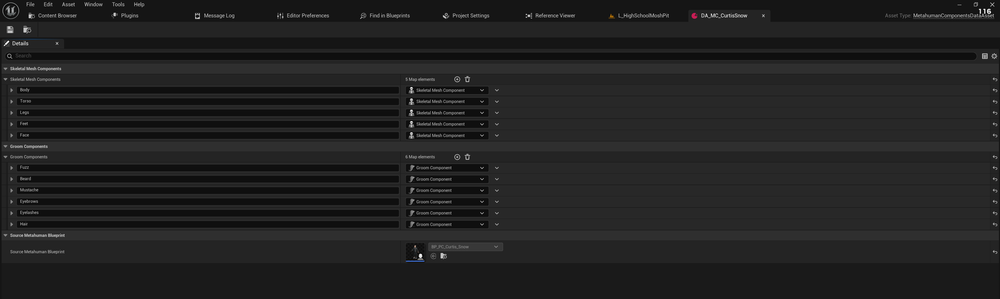
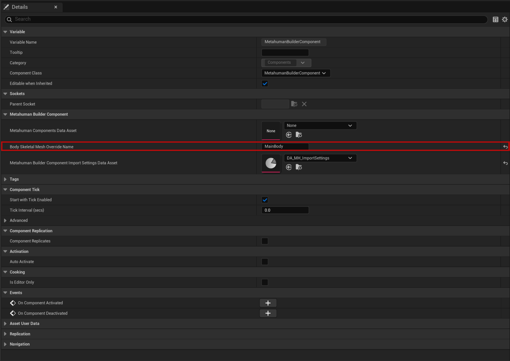
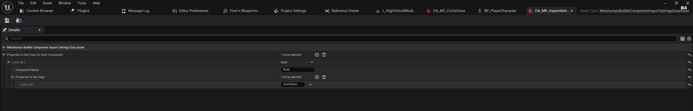
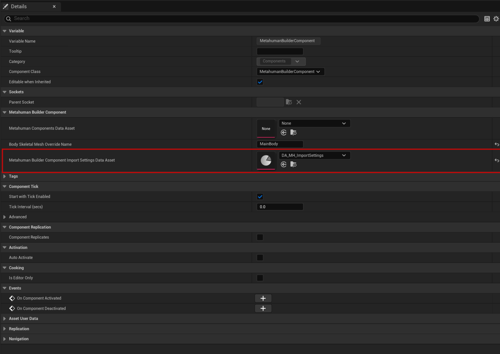

# Final Major Project

## Project Outline

**No Comments** is a third-person action game set in the underworld of low-level UK criminal activity. The narrative follows a single protagonist across a timeline stretching from school years to an unavoidable, consequential end. While stylistically inspired by the *Grand Theft Auto* franchise, the game eschews the open-world format in favour of more focused, linear gameplay combined with deeper, more punishing mechanics. A core feature is the implementation of hidden "stats" that are influenced by player decisions, creating branching gameplay outcomes and affecting future events.

For instance, the result of the first in-game fight (win or lose) will dynamically adjust the player's “Strength” parameter. A victory may boost this stat, potentially making future encounters easier, while a loss could reduce it, increasing difficulty. Importantly, these stats remain hidden from the player, encouraging immersive, in-world decision-making rather than number crunching.

---

### Minimal Goal – Fully Polished Fight Level

The fighting system forms the backbone of *No Comments* and is currently the central focus of development. The minimal deliverable for the project is a fully functional and polished combat level, complete with engaging and responsive brawling mechanics.

#### Key Objectives:
- Design a compact but immersive level centred around hand-to-hand combat.
- Develop enemy AI that presents a fair but challenging opponent.
- Implement responsive controls and impactful animations to convey weight and momentum.

#### Anticipated Challenges:
- Creating intelligent AI that adapts to player behaviour without becoming predictable.
- Ensuring that punches and movement feel “heavy” and satisfying through a combination of sound, visual feedback, and animation timing.
- Delivering fluid, context-aware animations that support both combat mechanics and the game's overall tone.

---

### Desired Goal – Stealth Integration

A stealth level is a secondary goal for the project, intended to provide variety and additional depth. The intention is to allow players the choice between silent infiltration and open combat. Ideally, stealth segments will transition smoothly into fights when necessary, depending on player choice or failure.

#### Key Objectives:
- Design a level that encourages exploration and experimentation with stealth mechanics.
- Integrate the fighting system seamlessly with stealth to allow for dynamic gameplay shifts.

#### Anticipated Challenges:
- Balancing stealth and combat to ensure neither approach trivialises the other.
- Managing transitions between stealth and combat states smoothly to avoid breaking immersion.
- Creating AI behaviours that can respond intelligently to both stealthy and aggressive playstyles.

---

### Aspirational Goal – Dynamic Hidden Stats and Event Variety

The hidden stat system is one of the project’s most distinctive features, offering a subtle but significant impact on gameplay and narrative progression. These stats, while not shown explicitly to the player, will shape encounters and potentially alter the path of the story. Although relatively straightforward to implement from a technical perspective, these systems require significant design iteration and testing to balance properly.

#### Key Objectives:
- Introduce at least three hidden parameters (Health, Damage, Intelligence, Stamina, Agility) that evolve based on player's actions.
- Link these stats to gameplay elements in a way that feels organic and meaningful.
- Introduce branching narrative or gameplay events that reflect the player’s stat profile, increasing replayability.

#### Anticipated Challenges:
- Making the impact of hidden stats noticeable without exposing numerical values.
- Ensuring that all gameplay paths remain viable, yet offer distinct challenges and outcomes.
- Avoiding excessive linearity by designing enough variance to encourage multiple playthroughs.

---

## Research

### Methodology

#### Books

* **Steve McConnell – *Code Complete***
  This book provides foundational principles of software development that are applicable across all programming domains, including game development. I’ve applied many of its suggestions throughout this project—such as maintaining clean and descriptive variable names, designing simple and intuitive class interfaces, and avoiding overly tight coupling between systems. These best practices significantly improved the readability and maintainability of my code, and likely saved me a considerable amount of debugging time.

#### Technical Documentation

* **[Unreal Engine 5 Documentation](https://dev.epicgames.com/documentation/en-us/unreal-engine/unreal-engine-5-5-documentation)**
  As the project was built entirely in Unreal Engine 5, the official documentation served as my primary source of technical reference. While not all entries are fully explanatory—many only list function parameters without deeper context—I consistently used it as a starting point. Specific sections, such as the Animation Sharing setup and the comprehensive guide on State Trees, were particularly helpful during development.

#### Talks and Presentations

* **[Maximising Your Game's Performance in Unreal Engine | Unreal Fest 2022](https://www.youtube.com/watch?v=GuIav71867E&t=2184s)**
  This talk offered a comprehensive overview of profiling tools within Unreal Insights. It aligned well with the optimisation work I undertook during this project, validating many of the techniques I used and helping me improve the overall performance of the game.

* **[State Tree Deep Dive | Unreal Fest 2024](https://www.youtube.com/watch?v=YEmq4kcblj4&t=1807s)**
  This presentation provided a detailed exploration of the new features in UE5.4 and UE5.5’s State Tree system—particularly considerations, which act as a lightweight built-in utility AI layer. It was especially valuable when implementing more nuanced combat logic and decision-making for AI behaviour.

---

#### Game References

* **Red Dead Redemption 2 – Hand-to-Hand Combat**
  While Red Dead Redemption 2 doesn’t place a major emphasis on hand-to-hand combat, its basic system (blocking, punching, and cinematic presentation) served as a visual and gameplay reference for us. Our goal was to make a more complex and challenging system inspired by this, incorporating similar core mechanics but allowing both the player and AI to engage in deeper tactical exchanges, such as potential counterattacks.

<iframe width="560" height="315" src="https://www.youtube.com/embed/O7KO6Aur0QA?si=oSHNlcw97qgWQzvr" title="YouTube video player" frameborder="0" allowfullscreen></iframe>

*Figure 1. Red Dead Redemption 2 hand-to-hand combat* 

* **Assassin's Creed Shadows – Stealth AI Behaviour**
  Although Assassin’s Creed Shadows features a significantly more advanced stealth system than what we intended to implement, its NPC behaviours served as a useful benchmark. Key elements we referenced include:

  * Line-of-sight and sound detection, influenced by environmental lighting
  * Memory of last known player position
  * Group alert behaviours and escalation
  * Transition from detection to combat
    These provided strong guidelines for our own AI stealth logic.

<iframe width="560" height="315" src="https://www.youtube.com/embed/iGGFy04r6vs?si=f0Z0x3MKV-6uj5Rz" title="YouTube video player" frameborder="0" allowfullscreen></iframe>

*Figure 2. Assassin's Creed Shadows stealth gameplay*

* **Kingdom Come: Deliverance – Skill Progression System**
  One of our design goals was to implement a hidden stat-based progression system that subtly adjusts gameplay over time. For instance, favouring combat over stealth would gradually make fights easier as the character's combat proficiency increases. This design is heavily inspired by Kingdom Come: Deliverance, where frequent use of a skill leads to levelling, which in turn unlocks additional capabilities (e.g., brewing potions automatically at high alchemy levels). It’s a great model for encouraging emergent gameplay styles and rewarding player agency.


*Figure 3. Kingdom Come Deliverance skills*


## Implementation

## Fight Imrpovements

## Motion Matching


## Tools

### Metahuman Data Extractor

#### Motivation

The *No Comments* project makes extensive use of Epic Games’ **MetaHuman** technology for all characters, including the player, enemies, and NPCs [(MetaHuman | Realistic Person Creator, s.d.)](https://www.unrealengine.com/en-US/metahuman). While this decision supports high-quality character visuals and animation fidelity, it introduced a number of significant technical challenges during implementation in Unreal Engine:

- Each MetaHuman is imported into Unreal Engine as a unique Blueprint containing specific skeletal meshes and groom (hair) components.
- Consequently, using multiple MetaHumans in a project often necessitates the creation of distinct character classes for each one.
- Attempting to integrate these elements into a unified, custom character class requires laborious manual transfer of skeletal mesh components from the MetaHuman Blueprint.
- Moreover, the rigid structure of the auto-generated Blueprints prevents developers from dynamically assigning MetaHuman assets at runtime, due to hardcoded references.

To address these challenges, I designed and implemented a custom plugin: **Metahuman Components Data Extractor**.

*Figure 4. Metahuman Components Data Extractor Plugin*

---

### Components Data Asset

The plugin’s core component is the `UMetahumanComponentsDataAsset`, a data asset designed to store and manage MetaHuman component data in a modular, runtime-accessible form. Its key elements include:

- **SkeletalMeshComponents**: A map of `FName` to `USkeletalMeshComponent*` that stores labelled skeletal mesh components (e.g., “Face”, “Body”) from the original MetaHuman Blueprint.
- **GroomComponents**: A similar map for hair and facial hair components.
- **SourceMetahumanBlueprint**: A `TSoftObjectPtr<UBlueprint>` reference pointing to the original MetaHuman Blueprint. As a soft reference, it avoids loading the entire asset into memory unless explicitly needed, which helps optimise performance and reduce memory overhead.


*Figure 5. Metahuman Components Data Asset example*

The plugin provides a critical function, `ExtractDataFromMetahumanBlueprint()`, which automates the process of parsing a provided MetaHuman Blueprint and extracting all relevant components. These are then stored in the data asset for use within a shared custom character class.

### Metahuman Setup Workflow

To streamline the character setup process and make it more user-friendly, I developed a **custom Editor Utility Widget**. This tool allows you to fully populate the necessary data by simply selecting the appropriate Data Asset and the Metahuman Blueprint imported via the Metahuman system. The widget handles the rest, significantly reducing the manual workload involved in preparing characters.

Once the component data has been exported and stored within the Data Asset, it needs to be applied to the character in-game. This is where the `UMetahumanBuilderComponent` comes into play.

Although the plugin is still in development and currently lacks full polish, it provides the core functionality required for runtime setup. I plan to improve its usability post-submission, but for now, the setup process involves the following steps:

1. **Attach the `UMetahumanBuilderComponent` to your character.**

2. **If no skeletal meshes are assigned**, the component will generate all necessary skeletal meshes from the provided Metahuman data.

3. **If the character has a single skeletal mesh**, it will be used as the main body mesh, while the component attaches all additional skeletal meshes and grooms accordingly.

4. **If the character includes multiple skeletal meshes**, the system will default to using the first mesh returned by the `GetComponents()` call as the body.
   If a specific mesh needs to be used, you can override it using `SetBodySkeletalMeshOverrideName()` in C++ or by setting the value directly in the Blueprint’s Details panel.

   
   *Figure 6. Body Skeletal Mesh Override field in Blueprint Details panel*

5. **To finalise the build process**, you must call `InitializeManagedOwnerComponents()`.
   It is strongly recommended to invoke this in the `PostActorCreated()` method. Doing so allows you to set the Data Asset via Blueprint defaults, ensuring the Metahuman is built automatically when the character is placed in the level:

   ```cpp
   void ANCCharacter_Base::PostActorCreated()
   {
       Super::PostActorCreated();

       // Skip execution on the Class Default Object
       if (HasAnyFlags(RF_ClassDefaultObject))
       {
           return;
       }

       if (!IsValid(MetahumanBuilderComponent))
       {
           ensureAlwaysMsgf(false, TEXT("!IsValid(MetahumanBuilderComponent)"));
           return;
       }

       MetahumanBuilderComponent->InitializeManagedOwnerComponents();
   }
   ```

   *Figure 7. Example of calling `InitializeManagedOwnerComponents()`*

6. **Specify the Import Settings** using a `UMetahumanBuilderComponentImportSettingsDataAsset`.
   This Data Asset holds override rules for properties that should *not* be copied from the main Data Asset—e.g., the Animation Blueprint, which you may want to maintain separately from the reference data.

   
   *Figure 8. Example of Import Settings Data Asset*

   The settings asset can be applied using the `SetMetahumanBuilderComponentImportSettingsDataAsset()` function in C++ or configured directly within the Blueprint editor:

   
   *Figure 9. Import Settings Data Asset field in Blueprint Details panel*


### Technical Challenges and Solutions

#### Identifying “Magic Values”

One of the main issues encountered during development was the reliance on **hardcoded property names** within the MetaHuman Blueprints. For example, distinguishing the “Face” skeletal mesh from the “Body” mesh is only possible by checking the component's name, which is consistent across MetaHuman imports but not formally exposed or documented.

These string-based identifiers, such as `"Face"`, `"Torso"`, `"Legs"`, and their equivalents for groom components, function as *magic values*—arbitrary constants embedded in code. As McConnell (2004:338) notes, such values represent global data that conceptually applies to the entire application (in our case, to the entire plugin) and should be centralised to reduce redundancy and error-proneness.

To manage this, I created a subclass of `UDeveloperSettings` called `UMetahumanComponentDataExtractorSettings`. This class provides a centralised configuration for the MetaHuman component names and relevant references:

```cpp
UCLASS(Config=Editor, defaultconfig)
class METAHUMANCOMPONENTDATAEXTRACTOR_API UMetahumanComponentDataExtractorSettings : public UDeveloperSettings
{
    GENERATED_BODY()

private:
    UPROPERTY(Config, EditDefaultsOnly, BlueprintReadOnly, meta = (AllowPrivateAccess = "true"))
    TArray<FName> SkeletalMeshComponentPropertyNames;

    UPROPERTY(Config, EditDefaultsOnly, BlueprintReadOnly, meta = (AllowPrivateAccess = "true"))
    TArray<FName> GroomComponentPropertyNames;

    UPROPERTY(Config, EditDefaultsOnly, BlueprintReadOnly, meta = (AllowPrivateAccess = "true"))
    FName BodySkeletalMeshComponentPropertyName = "Body";

    UPROPERTY(Config, EditDefaultsOnly, BlueprintReadOnly, meta = (AllowPrivateAccess = "true"))
    FName FaceSkeletalMeshComponentPropertyName = "Face";

    UPROPERTY(Config, EditDefaultsOnly, BlueprintReadOnly, meta = (AllowPrivateAccess = "true"))
    TSoftObjectPtr<UBlueprint> MetahumanComponentDataExtractorWidget;

public:
    const TArray<FName>& GetSkeletalMeshComponentPropertyNames() const;
    const TArray<FName>& GetGroomComponentPropertyNames() const;
    FName GetBodySkeletalMeshComponentPropertyName() const;
    FName GetFaceSkeletalMeshComponentPropertyName() const;
    TSoftObjectPtr<UBlueprint> GetMetahumanComponentDataExtractorWidget() const;
};
```

These values can be accessed in any relevant C++ context as follows:

```cpp
const UMetahumanComponentDataExtractorSettings* Settings = GetDefault<UMetahumanComponentDataExtractorSettings>();
TArray<FName> SkeletalMeshNames = Settings->GetSkeletalMeshComponentPropertyNames();
```

This design enhances maintainability and readability, and ensures consistency across the codebase.

Here's a refined version of that section, keeping your original meaning intact but improving clarity, structure, and grammar for professional development commentary:

---

### Custom Property Data Copy

The default `DuplicateObject` function in Unreal Engine provides no granular control over which properties should or shouldn't be copied. To address this, I implemented a custom copying function that iterates over all `UProperty` fields of a given source object. It skips any properties specified in a list of names to ignore, and performs a manual copy by serialising and deserialising each property:

```cpp
void UBlueprintDataExtractionFL::CopyPropertiesFromOneObjectToAnother(UObject* Source,
                                                                       UObject* Destination,
                                                                       const TArray<FName>& PropertiesToIgnore)
{
	for (TFieldIterator<FProperty> PropertyIterator(Source->GetClass()); PropertyIterator; ++PropertyIterator)
	{
		FProperty* Property = *PropertyIterator;

		// Only consider properties that are visible and editable in Blueprints
		if (!Property->HasAnyPropertyFlags(CPF_Edit | CPF_BlueprintVisible))
		{
			continue;
		}

		// Skip properties marked for exclusion
		if (PropertiesToIgnore.Contains(Property->GetFName()))
		{
			continue;
		}

		// Serialize the property's value from source and import it into destination
		FString SerializedProperty;
		Property->ExportTextItem_Direct(SerializedProperty, Property->ContainerPtrToValuePtr<void>(Source), nullptr, Source, PPF_None);
		Property->ImportText_Direct(*SerializedProperty, Property->ContainerPtrToValuePtr<void>(Destination), Destination, PPF_None);
	}
}
```

This approach gives precise control over property copying, which was especially useful in cases where only a subset of Blueprint-exposed properties should be transferred.

---

### Resolving Packaging Errors

After implementing the full functionality, I encountered a build issue: the plugin failed to package due to a dependency on the `UnrealEd` module, which is editor-only and not compatible with runtime builds. To resolve this, I:

* Moved all editor-related functionality (e.g. Editor Utility Widgets, custom thumbnail logic) into a separate editor-only module.
* Wrapped all `PostEditChangeProperty()` overrides with `#if !UE_BUILD_SHIPPING` to ensure they are excluded from shipping builds:

```cpp
#if !UE_BUILD_SHIPPING
	virtual void PostEditChangeProperty(struct FPropertyChangedEvent& PropertyChangedEvent) override;
#endif
```

These changes allowed the plugin to be successfully included in a packaged build without sacrificing editor utility.

---

### Utility Widget Filtering Limitation

One unresolved issue was filtering the Blueprint selection field in the Editor Utility Widget — specifically the **"Source Metahuman Blueprint"** property. Currently, the property displays all Blueprint assets in the project, which clutters the dropdown with unrelated options:


Unfortunately, default editor property customisation does not support filtering UClass asset pickers by inheritance or tags in utility widgets. The only viable solution I found was to write a custom Slate widget to replace the dropdown entirely — a task that exceeded the project's scope and time frame. Research into a more efficient solution is ongoing.

---


### Process
- Provide a step-by-step breakdown of your development process, including key milestones and decisions made throughout the project.  
- Highlight any tools, frameworks, or techniques used, and explain how they contributed to the implementation.  
- Include screenshots, diagrams, or code snippets where relevant to showcase your progress.

### New Approaches  
- Detail any innovative or new approaches you explored during the project.  
- Explain why these approaches were chosen and how they differ from standard practices.  
- Evaluate the success of these approaches, including any challenges faced and lessons learned.

### Testing
- Document the user testing conducted, specifying the type of tests used (e.g., automated testing, guided user testing, blind testing).  
- Present feedback or issues identified during testing, using graphs, tables, or visual aids to summarise results.  
- Describe how these issues were addressed. If any issues were not resolved, provide a clear justification for leaving them unaddressed.

### Technical Difficulties
- Identify any technical difficulties encountered during the implementation phase.  
- Provide details on how these issues were diagnosed and resolved.  
- If any difficulties remain unresolved, explain the impact on the project and any mitigation strategies used to minimise their effect.  
- Reflect on what you would do differently in future projects to avoid similar issues.

## Outcomes

TO BE FILLED LATER


## Reflection
TO BE FILLED LATER

## Bibliography  

## Declared Assets
Assets generated by ChatGPT:
- DevelopmentCommentary.md

Sound effects:
- Crowd sounds:
https://freesound.org/people/DavBlahBlah/sounds/632294/
https://freesound.org/people/timothyd4y/sounds/472606/

- Mumbling sound
https://freesound.org/people/so0rec/sounds/542589/