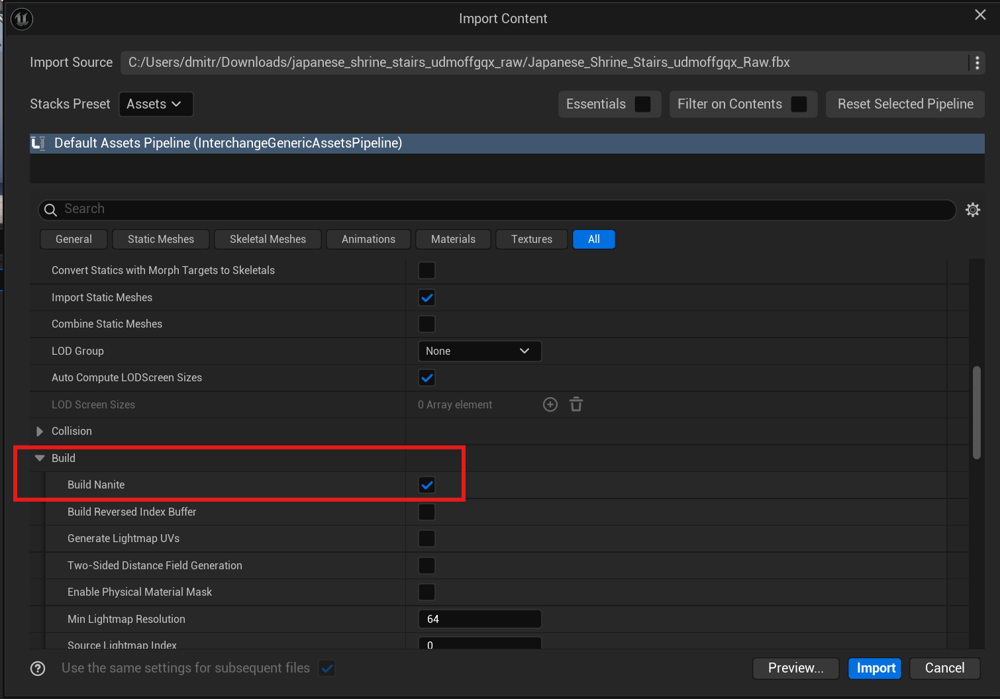
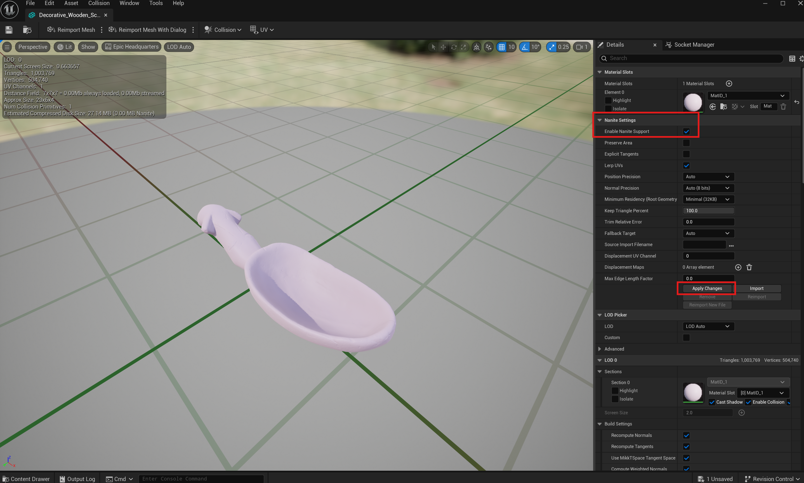
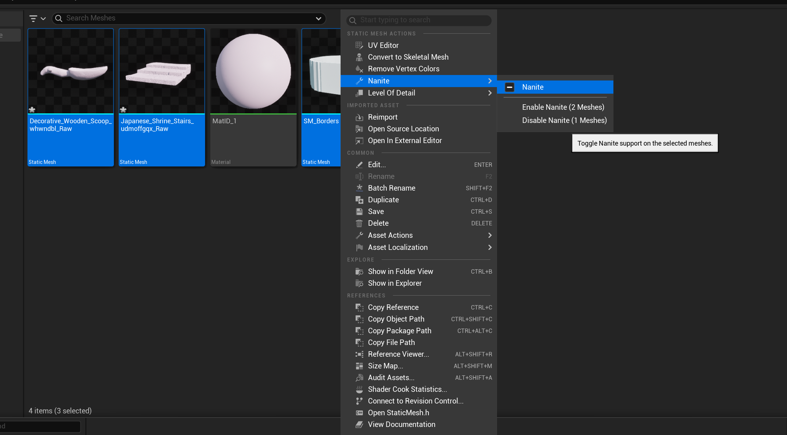
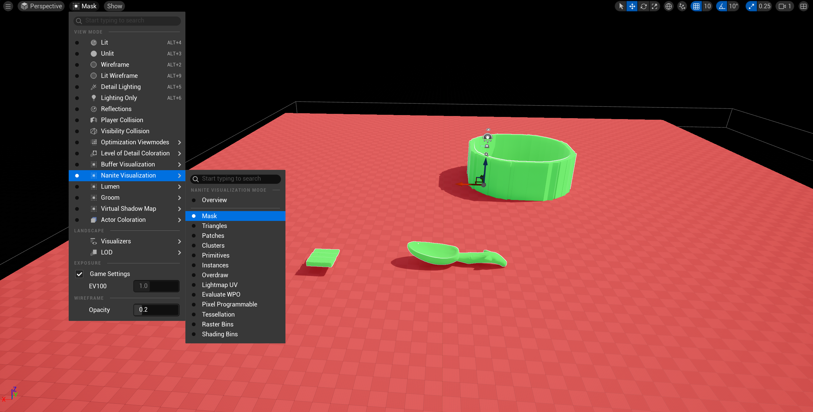
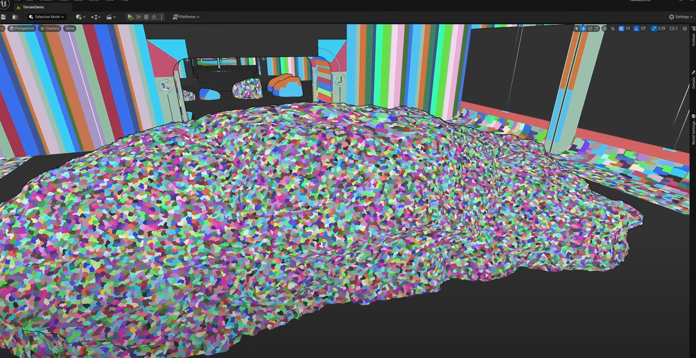
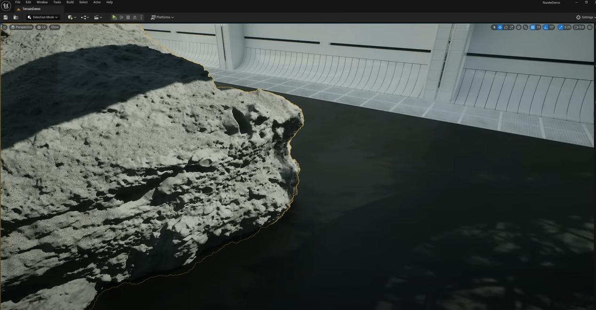
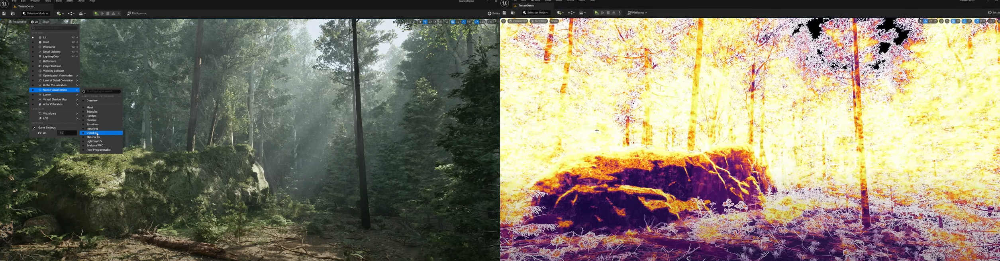

# Nanite

## What is Nanite?
Nanite is Unreal Engine 5's virtualised geometry system. It uses a new internal mesh format and advanced rendering technology to deliver pixel-scale details and support high object counts efficiently.

### Key Features:
- **Highly compressed data format**: Fine-grained streaming with automatic Level of Detail (LOD).
- **Optimised rendering**: Frame counts are no longer constrained by poly counts, draw calls, or mesh memory usage.
- **No individual LOD setup**: LOD transitions are automatic with minimal to no quality loss.
- **Efficient streaming**: Only streams visible details for optimal performance.

### Benefits:
- Nanite provides virtualised geometry, ensuring high performance by dynamically loading only the required details of a mesh based on the camera’s perspective.

---

## Nanite vs Static Mesh

*Figure 1. Nanite mesh on the right and static mesh on the left.*

### Differences:
- A Nanite mesh is a static mesh with Nanite enabled.
- Nanite uses advanced LOD and data compression techniques, while also employing a new rendering system for enhanced efficiency.
- Materials and shaders for Nanite meshes work similarly to traditional static meshes but benefit from Nanite's optimisations.
- Virtual Textures are recommended for use with Nanite meshes but not mandatory.

---

## Enabling Nanite
### On Import

- Enable **Build Nanite** in the **Static Meshes → Build** settings during the import process.

### In the Static Mesh Details Panel

1. Check the **Enable Nanite Support** box.
2. Press **Apply Changes** to generate Nanite-specific data for the mesh.

### Batch Enabling for Multiple Meshes
1. Select all the static meshes in the Content Browser.
2. Right-click the selected objects.
3. Choose the appropriate option to enable Nanite.

### Verifying Nanite
- Use the viewport **View Mode** settings:
  - Select **Nanite Visualization → Mask**.
  - Nanite-enabled geometry will appear **green**, while non-Nanite geometry will appear **red**.

---

## How Nanite Works

### Optimised Geometry Streaming
- Nanite dynamically divides a mesh into thousands of clusters.
- Each cluster represents a group of triangles.
- Smaller screen space for the mesh results in larger clusters and vice versa.
- Only visible clusters are rendered based on the camera's point of view.

#### Example:

### Occlusion Culling
- Nanite skips rendering fully occluded objects, improving performance significantly.

*Figure 3. Example of Nanite skipping occluded objects.*

### Best Practices for Nanite Geometry
1. **Continuous Geometry**: Use connected geometry to form a single mesh.
2. **Avoid Intersections**: Self-intersecting geometry may cause rendering artefacts.

*Figure 4. Example of rendering issues with self-intersecting geometry.*

3. **Minimise Overdraw**: Avoid overlapping triangles, as it impacts performance.

*Figure 5. Example of overdraw.*

---

## When Nanite Struggles

### Foliage and Trees
- Trees and foliage present challenges due to:
  - Disconnected elements (e.g., leaves and branches).
  - Poor occlusion due to gaps and transparency.
  - High overdraw due to layering of elements.

#### Example:

*Card-based foliage rendering (pre-Nanite).*

- Nanite aims for per-leaf geometry representation:

  - However, this increases poly count and file size (e.g., a 4.5-million-triangle tree weighing 154MB vs. a 2-million-triangle rock at 16MB).

#### Workaround:
- Use procedural content generation (PCG) tools to optimise foliage creation.
- [Tutorial with Timecode](https://www.youtube.com/watch?v=eoxYceDfKEM&t=15m32s).

---

## Materials Supported by Nanite
- Supported Blend Modes: **Opaque** and **Masked**.
- Unsupported Materials:
  - Translucent materials (e.g., mesh decals).

### Notes:
- Nanite meshes can receive decals but cannot use **Mesh Decals** requiring Translucent Blend Mode.
- **Vertex Interpolator** nodes and **Custom UVs** are supported but may increase computational cost.
- Custom expressions (e.g., Parallax Occlusion Mapping) may result in artefacts due to lack of analytic derivative support.

